

    

# Dev Learning Hub 
### -Analysis-

  

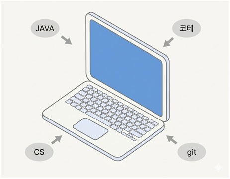

#### 22112074
#### 이재엽 
#### dlwoduq0@naver.com

  

## Revision History

| Revision date | Version # | Description | Author |
|--------------|-----------|-------------|---------|
| 05/05/2026 | 1.00 | 초기 버전 | |

## Contents

1. [Introduction](#1-introduction)
2. [Use case analysis](#2-use-case-analysis)
3. [Domain analysis](#3-domain-analysis)
4. [User Interface prototype](#4-user-interface-prototype)
5. [Glossary](#5-glossary)
6. [References](#6-references)

---

## 1. Introduction

### 1) Executive Summary

현재 세계는 4차산업혁명을 맞이하여 비약적인 기술의 발전을 통해 시장의 많은 것들이 급격하게 변화하고 있는 상황이다. 이러한 시장의 중심에 있는 것은 바로 IT인력으로 AI가 새롭게 나오게 됨에 따라서 앞으로 컴퓨터 공학을 졸업하고 개발자로써 나아갈 컴퓨터 공학과 학생들에게 요구되어지는 역량 또한 나날이 갈수록 높아지고 있는 상황이다. 따라서 컴퓨터 공학 지식, 알고리즘 코딩테스트, 프로젝트 경험등 많은 측면에서 학생들의 여러 역량을 끌어올리는 것에 도움이 될 수 있도록 Dev learning Hub라는 이 프로그램을 개발하게 되었다.

### 2) Business Goals

대학생으로 가장 역량을 끌어올리는 것에 있어 가장 중요한 기준은 바로 기본에 충실하여 꾸준히 나아가는 것이라고 생각한다. 성을 쌓을 때도 기반이 튼튼하지 않고 계속 쌓다간 무너지듯이 기반을 제대로 다져놓지 않고 새로운 기술을 받아들이려 한다면 얼마안가 무너질 것이다. 따라서 현재 대학 교육 커리큘럼에 따라 차근차근 학습을 진행할 수 있도록 시간표와 달력 기능, to-do list기능을 통해 계획 설정 및 목표를 설정하고 나아갈 수 있도록 하며 또한 Github 활동 내역, 코딩테스트 문제 풀이 내역을 확인하며 교과과정 외의 개발자로써 필요한 역량을 얻기 위해 목표 설정이 가능할 수 있도록 하였다. 이렇게 목표를 설정하고 성취를 이뤄낸다면 이 또한 꾸준한 학습을 하는 것에 좋은 동기부여가 되어줄 수 있을 것이다.

### 3) Technical Goals

이 프로젝트에서는 기본적으로 Github API, solved.ac API를 통해 데이터를 받아옴으로써 기능을 구현하고자 했으나 백준 웹사이트가 서비스를 종료하게 됨에 따라서 백준이 아닌 프로그래머스의 문제풀이내역을 가져오고자 하였다. 하지만 프로그래머스는 별도로 API가 없기에 크롬의 웹 확장 프로그램인 백준 허브라는 프로그램이 프로그래머스에서 문제를 풀 시, Dom감지에 따라 즉각적으로 연동된 Github상의 레포지토리에 문제 풀이 내역을 올려준다는 것을 활용해 문제 풀이 내역 또한 Github API를 통해 성공적으로 받아오고자 한다. 이러한 내용 또한 Github ID와 문제풀이내역이 저장될 레포지토리가 정상적으로 DB에 저장된다면을 가정했을 때의 내용이니 시간표, 달력, to-do list등 전반적으로 DB가 정상적으로 저장되고 사용될 수 있도록 하게 할 것이다.

---

## 2. Use case analysis

### 2.1. Use Case Diagram

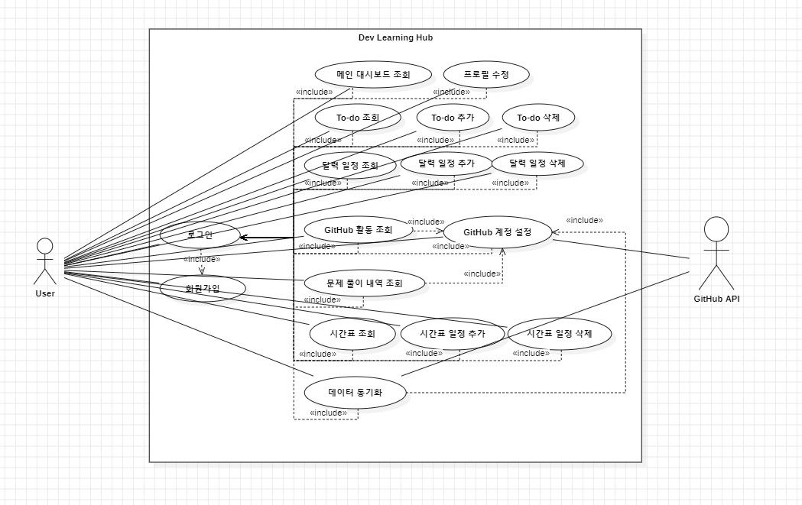

위 그림은 Dev Learning Hub의 Use Case Diagram이다 이 다이어그램에서는 모든 기능은 로그인이 되어야 실행시킬 수 있도록 하였으며 특히 GitHub와 관련된 기능인 GitHub 활동 조회 기능은 계정 등록이 되어야만 실행시킬 수 있도록 하였으며 문제 풀이 내역 조회는 계정 등록과 더불어 레포지토리 설정까지 마쳐야만 실행시킬 수 있도록 하였다. 마찬가지로 데이터 동기화 또한 계정 등록과 레포지토리 설정이 끝나야만 실행시킬 수 있도록 하였다. 또한 깃허브 활동 내역, 문제 풀이 내역에 대한 데이터를 받아올 수 있도록 Github API라는 외부 Actor을 만들어 2개의 기능과 연관관계를 맺어주었다.

### 2.2. Use Case Description

#### Use Case #1 : 회원가입

**GENERAL CHARACTERISTICS**

| | |
|---|---|
| Summary | 회원인증을 받아 기능을 수행할 수 있도록 회원등록을 해주는 기능 |
| Scope | Dev Learning Hub |
| Level | User Level |
| Author | Lee JaeYeop |
| Last Update | 2026-05-05 |
| Status | Analysis |
| Primary Actor | User |
| Preconditions | System이 실행이 되고있는 상태. |
| Trigger | 메인 대시보드에서 회원가입을 버튼을 눌렀을 때 |
| Success Post Condition | 성공적으로 DB에 회원정보가 등록이 된다. |
| Failed Post Condition | 에러 메시지 창이 나타난다. |

**MAIN SUCCESS SCENARIO**

| Step | Action |
|------|--------|
| S | 유저가 회원등록을 위해 회원가입을 한다. |
| 1 | 유저가 메인 대시보드에서 회원가입 버튼을 누른다. |
| 2 | 시스템은 회원에게 회원가입을 하기 위한 입력창을 보여준다. |
| 3 | 유저는 폼에 아이디와 비밀번호를 입력하고 확인 버튼을 누른다. |
| 4 | 시스템은 입력받은 아이디와 비밀번호를 DB에 저장한다. |
| 5 | 시스템이 회원가입에 성공했다는 메시지를 보여주고 메인 대시보드 화면으로 돌아간다. |

**EXTENSION SCENARIOS**

| Step | Branching Action |
|------|------------------|
| 4 | 4a. 아이디나 비밀번호를 입력하지 않고 확인 버튼을 누른다 4a1. 아이디나 비밀번호를 입력해달란 메시지를 보여준다 4a2. 이전 단계로 돌아간다(Use case #1-2)  4b. 이미 가입되어 있는 ID로 회원가입을 시도한다. 4b1. 이미 가입된 사용자라는 메시지를 보여준다. 4b2. 이전 단계로 돌아간다(Use case #1-2)  4c. 이메일을 입력할 때 올바른 이메일 형식이 아니게 입력한다. 4c1. 올바른 이메일 형식으로 입력해달란 에러메시지가 나타난다. 4c2. 이전 단계로 돌아간다(Use case #1-2)  4d. 비밀번호와 비밀번호 확인의 내용이 같지 않다. 4d1. 비밀번호를 다시 한번 확인해달란 에러메시지가 나타난다. 4d2. 이전 단계로 돌아간다(Use case #1-2) |

**RELATED INFORMATION**

| | |
|---|---|
| Performance | ≤ 3 Seconds |
| Frequency | Variable |
| Concurrency | None |
| Due Date | 2026-05-27 |

---

#### Use Case #2 : 로그인

**GENERAL CHARACTERISTICS**

| | |
|---|---|
| Summary | 유저가 Dev Learning Hub 사용을 위해 회원인증을 받기 위한 기능 |
| Scope | Dev Learning Hub |
| Level | User Level |
| Author | Lee JaeYeop |
| Last Update | 2026-05-05 |
| Status | Analysis |
| Primary Actor | User |
| Preconditions | 회원가입이 되어 있어야한다. |
| Trigger | 메인 대시보드에서 로그인 버튼을 누른다. |
| Success Post Condition | 시스템에게 유저 인증을 받게 된다. 이후 모든 기능을 사용할 수 있게 된다, |
| Failed Post Condition | 시스템에게 유저 인증을 받지 못한다. 이후에 주요 기능을 사용하지 못한다. |

**MAIN SUCCESS SCENARIO**

| Step | Action |
|------|--------|
| S | 회원이 Dev Learning Hub에 로그인 한다. |
| 1 | 메인 대시보드에서 로그인 버튼을 누른다. |
| 2 | 시스템은 유저에게 로그인창을 보여준다. |
| 3 | 유저는 로그인 창에 아이디와 비밀번호를 입력하고 로그인 버튼을 클릭한다. |
| 4 | 시스템이 해당 유저가 등록된 회원인지 체크하고 맞다면 로그인에 성공한다. |
| 5 | 로그인이 성공할 시 비활성화되어 있는 모든 기능이 활성화 된다. |

**EXTENSION SCENARIOS**

| Step | Branching Action |
|------|------------------|
| 3 | 3a. 아이디나 비밀번호를 입력하지 않고 로그인 버튼을 클릭한다. 3a1. 아이디나 비밀번호를 모두 입력해달라는 메시지를 보여준다. |
| 4 | 4a. 아이디나 비밀번호가 잘못되어 로그인에 실패한다. 4a1. 아이디나 비밀번호가 잘못되었다는 메시지를 보여준다. 4a2. 아이디와 비밀번호를 입력하는 단계로 넘어간다(Use case #2-2) |

**RELATED INFORMATION**

| | |
|---|---|
| Performance | ≤ 3 Seconds |
| Frequency | Variable |
| Concurrency | None |
| Due Date | 2026-05-27 |

---

#### Use Case #3 : 메인 대시보드 조회

**GENERAL CHARACTERISTICS**

| | |
|---|---|
| Summary | 전반적인 학습 데이터가 나와있는 메인 대시보드를 조회하기 위한 기능 |
| Scope | Dev Learning Hub |
| Level | User Level |
| Author | Lee JaeYeop |
| Last Update | 2026-05-05 |
| Status | Analysis |
| Primary Actor | User |
| Preconditions | 로그인이 되어야 한다. |
| Trigger | 로그인에 성공할 시 |
| Success Post Condition | 프로필, 레이아웃, 학습데이터등 메인 대시보드 내용이 출력된다. |
| Failed Post Condition | 로그인이 되지 않았기에 모든 기능을 사용할 수 없다. |

**MAIN SUCCESS SCENARIO**

| Step | Action |
|------|--------|
| S | 유저가 메인 대시보드를 조회한다. |
| 1 | 유저가 로그인에 성공한다. |
| 2 | 시스템이 DB에 저장된 각종 데이터를 호출한다. |
| 3 | 시스템이 받아온 데이터를 기반으로 메인 대시보드 화면을 출력한다. |

**RELATED INFORMATION**

| | |
|---|---|
| Performance | ≤ 3 Seconds |
| Frequency | Variable |
| Concurrency | None |
| Due Date | 2026-05-27 |

---

#### Use Case #4 : 프로필 수정

**GENERAL CHARACTERISTICS**

| | |
|---|---|
| Summary | 사용자가 자신의 닉네임이나 프로필 사진을 변경하는 기능 |
| Scope | Dev Learning Hub |
| Level | User Level |
| Author | Lee JaeYeop |
| Last Update | 2026-05-05 |
| Status | Analysis |
| Primary Actor | User |
| Preconditions | 로그인이 된 메인 대시보드에서 시작해야한다. |
| Trigger | 메인 대시보드에서 프로필 클릭시 |
| Success Post Condition | 성공적으로 프로필 정보가 변경된다. |
| Failed Post Condition | 프로필 정보가 변경되지 않는다. |

**MAIN SUCCESS SCENARIO**

| Step | Action |
|------|--------|
| S | 사용자가 자신의 닉네임이나 프로필 사진을 변경한다. |
| 1 | 유저가 메인 대시보드에서 프로필을 클릭한다. |
| 2 | 시스템이 닉네임과 프로필 사진을 입력받기 위한 창을 보여준다. |
| 3 | 유저는 프로필 사진을 첨부하거나 닉네임을 입력하여 확인 버튼을 클릭한다. |
| 4 | 시스템이 변경된 정보를 DB로 보낸다. |
| 5 | 다시 DB로부터 데이터를 받아 변경된 프로필 화면을 출력한다. |

**EXTENSION SCENARIOS**

| Step | Branching Action |
|------|------------------|
| 3 | 3a. 유저가 아무런 정보를 입력하지 않고 확인 버튼을 클릭한다. 3a1. 아무런 변경사항이 없을 시 버튼이 비활성화되어 변경되지 않는다. |

**RELATED INFORMATION**

| | |
|---|---|
| Performance | ≤ 3 Seconds |
| Frequency | Variable |
| Concurrency | None |
| Due Date | 2026-05-27 |

---

#### Use Case #5 : Github 계정 설정

**GENERAL CHARACTERISTICS**

| | |
|---|---|
| Summary | 깃허브 계정, 문제풀이내역 레포지토리 설정을 위한 기능 |
| Scope | Dev Learning Hub |
| Level | User Level |
| Author | Lee JaeYeop |
| Last Update | 2026-05-05 |
| Status | Analysis |
| Primary Actor | User |
| Preconditions | 로그인이 되어 있어야 한다. |
| Trigger | 메인 화면의 GitHub 설정 버튼을 클릭시 |
| Success Post Condition | 성공적으로 깃허브 계정과 레포지토리가 설정되어 이후 관련 기능을 사용할 수 있게 된다. |
| Failed Post Condition | 깃허브 계정과 레포지토리가 설정되지 않아 이후 관련 기능 외의 기능만 사용할 수 있게 된다. |

**MAIN SUCCESS SCENARIO**

| Step | Action |
|------|--------|
| S | 깃허브 계정과 문제 풀이 내역 레포지토리를 설정한다. |
| 1 | 유저가 메인 대시보드에서 상단의 깃허브 설정 버튼을 클릭한다. |
| 2 | 시스템은 유저에게 깃허브 계정과 레포지토리를 입력받도록 입력창을 보여준다. |
| 3 | 유저는 입력창에다가 깃허브 계정과 물제 풀이 내역 레포지토리를 입력하고 확인 버튼을 클릭한다. |
| 4 | 시스템은 Github API를 통해 문제가 없는지 확인하고 문제가 없다면 DB에 저장한다. |
| 5 | 성공적으로 기능이 수행되었다면 비활성화된 관련 기능이 활성화되고 깃허브 설정 버튼은 동기화 버튼으로 바뀐다. |

**EXTENSION SCENARIOS**

| Step | Branching Action |
|------|------------------|
| 3 | 3a. 입력창에 계정이나 레포지토리를 입력하지 않고 확인 버튼을 누를 경우. 3a1. 입력창에 모든 정보가 기입되지 않으면 버튼은 비활성화가 되기에 기능이 실행되지 않는다. |
| 4 | 4a. 입력받은 계정이 존재하지 않는 계정일 경우. 4a1. 시스템이 존재하지 않는 계정이라고 메시지를 출력한다. 4a2. 원래 화면으로 돌아간다.(Use case #5-2)  4b. 입력받은 레포지토리가 해당 계정에 존재하지 않을 경우. 4b1. 시스템이 존재하지 않는 레포지토리라고 메시지를 출력한다. 4b2. 원래 화면으로 돌아간다.(Use case #5-2)  4c. GitHub API를 통한 연결에 문제가 발생할 시 4c1. 연결이 불안정하다는 팝업 메시지를 화면에 출력한다. |

**RELATED INFORMATION**

| | |
|---|---|
| Performance | ≤ 3 Seconds |
| Frequency | Variable |
| Concurrency | None |
| Due Date | 2026-05-27 |

---

#### Use Case #6 : To-do 조회

**GENERAL CHARACTERISTICS**

| | |
|---|---|
| Summary | 작성된 to-do 리스트를 조회하기 위한 기능 |
| Scope | Dev Learning Hub |
| Level | User Level |
| Author | Lee JaeYeop |
| Last Update | 2026-05-05 |
| Status | Analysis |
| Primary Actor | User |
| Preconditions | 로그인이 되어 있어야 한다. |
| Trigger | 메인 대시보드에서 To-do list 클릭시 |
| Success Post Condition | 작성된 to-do list 내용이 보인다. |
| Failed Post Condition | to-do list 화면이 보이지 않는다. |

**MAIN SUCCESS SCENARIO**

| Step | Action |
|------|--------|
| S | 저장된 to-do list 내용을 조회할 수 있다. |
| 1 | 유저가 메인 대시보드에서 to-do list 버튼을 클릭한다. |
| 2 | 시스템은 즉시 DB에 to-do list 내용이 저장된 데이터를 호출한다. |
| 3 | 시스템은 호출받은 데이터를 기반으로 to-do list 화면을 출력한다. |

**RELATED INFORMATION**

| | |
|---|---|
| Performance | ≤ 3 Seconds |
| Frequency | Variable |
| Concurrency | None |
| Due Date | 2026-05-27 |

---

#### Use Case #7 : To-do 추가

**GENERAL CHARACTERISTICS**

| | |
|---|---|
| Summary | to-do list의 할 일을 추가하는 기능. |
| Scope | Dev Learning Hub |
| Level | User Level |
| Author | Lee JaeYeop |
| Last Update | 2026-05-05 |
| Status | Analysis |
| Primary Actor | User |
| Preconditions | 로그인이 된 상태여야 한다. |
| Trigger | 할 일 추가 버튼 클릭시 |
| Success Post Condition | 시스템이 성공적으로 변경된 to-do list 화면을 출력한다. |
| Failed Post Condition | 이전과 변함이 없는 to-do list 화면을 출력한다. |

**MAIN SUCCESS SCENARIO**

| Step | Action |
|------|--------|
| S | to-do list의 내용을 편집한다. |
| 1 | 유저가 to-do list 화면에서 할 일을 입력하고 추가 버튼을 클릭한다. |
| 2 | 시스템이 변경사항을 DB에 전달한다. |
| 3 | 시스템이 DB로부터 새롭게 데이터를 받아 화면을 출력한다. |

**RELATED INFORMATION**

| | |
|---|---|
| Performance | ≤ 3 Seconds |
| Frequency | Variable |
| Concurrency | None |
| Due Date | 2026-05-27 |

---

#### Use Case #8 : To-do 삭제

**GENERAL CHARACTERISTICS**

| | |
|---|---|
| Summary | to-do list의 할 일을 삭제하는 기능. |
| Scope | Dev Learning Hub |
| Level | User Level |
| Author | Lee JaeYeop |
| Last Update | 2026-05-05 |
| Status | Analysis |
| Primary Actor | User |
| Preconditions | 로그인이 된 상태여야 한다. |
| Trigger | 할 일 삭제 버튼 클릭시 |
| Success Post Condition | 시스템이 성공적으로 변경된 to-do list 화면을 출력한다. |
| Failed Post Condition | 이전과 변함이 없는 to-do list 화면을 출력한다. |

**MAIN SUCCESS SCENARIO**

| Step | Action |
|------|--------|
| S | to-do list의 내용을 편집한다. |
| 1 | 유저가 to-do list 화면에서 할 일 내역 우측의 삭제 버튼을 클릭한다. |
| 2 | 시스템이 변경사항을 DB에 전달한다. |
| 3 | 시스템이 DB로부터 새롭게 데이터를 받아 화면을 출력한다. |

**RELATED INFORMATION**

| | |
|---|---|
| Performance | ≤ 3 Seconds |
| Frequency | Variable |
| Concurrency | None |
| Due Date | 2026-05-27 |

---

#### Use Case #9 : 달력 일정 조회

**GENERAL CHARACTERISTICS**

| | |
|---|---|
| Summary | 유저가 저장된 달력 일정을 확인하기 위한 기능 |
| Scope | Dev Learning Hub |
| Level | User Level |
| Author | Lee JaeYeop |
| Last Update | 2026-05-05 |
| Status | Analysis |
| Primary Actor | User |
| Preconditions | 로그인이 된 상태여야 한다. |
| Trigger | 메인 대시보드에서 캘린더 버튼을 클릭할 시 |
| Success Post Condition | 달력 위의 정상적으로 저장된 일정이 출력되어 나온다. |
| Failed Post Condition | 정상적으로 저장된 달력 일정을 확인할 수 없다. |

**MAIN SUCCESS SCENARIO**

| Step | Action |
|------|--------|
| S | 유저가 달력 일정을 조회한다. |
| 1 | 유저가 메인 대시보드에서 캘린더 버튼을 누른다. |
| 2 | 시스템은 DB로부터 저장된 일정에 관한 데이터를 호출한다. |
| 3 | 시스템이 DB로부터 데이터를 받아 화면을 출력한다. |

**RELATED INFORMATION**

| | |
|---|---|
| Performance | ≤ 3 Seconds |
| Frequency | Variable |
| Concurrency | None |
| Due Date | 2026-05-27 |

---

#### Use Case #10 : 달력 일정 추가

**GENERAL CHARACTERISTICS**

| | |
|---|---|
| Summary | 유저가 달력 일정을 추가하거나 위한 기능 |
| Scope | Dev Learning Hub |
| Level | User Level |
| Author | Lee JaeYeop |
| Last Update | 2026-05-05 |
| Status | Analysis |
| Primary Actor | User |
| Preconditions | 로그인 된 상태여야 한다. |
| Trigger | 캘린더 화면에서 일정 추가 버튼을 클릭시 |
| Success Post Condition | 회원가입 정보를 적는 양식이 보인다. |
| Failed Post Condition | 회원가입 정보를 적는 양식이 보이지 않는다. |

**MAIN SUCCESS SCENARIO**

| Step | Action |
|------|--------|
| S | 유저가 캘린더에 일정을 추가한다. |
| 1 | 유저가 캘린더 화면에서 일정 추가 버튼을 클릭한다. |
| 2 | 시스템이 제목, 날짜, 시간, 유형을 입력받기 위해 입력창을 보여준다. |
| 3 | 유저가 제목, 날짜, 시간, 유형을 입력하고 추가 버튼을 클릭한다. |
| 4 | 시스템이 이 내용을 DB에 전달한다. |
| 5 | 시스템이 DB로부터 데이터를 전달받아 업데이트된 화면을 출력한다. |

**EXTENSION SCENARIOS**

| Step | Branching Action |
|------|------------------|
| 3 | 3a. 유저가 하나라도 정보를 입력하지 않고 추가 버튼을 클릭할 경우 3a1. 모든 입력란에 정보를 기입하지 않으면 추가 버튼은 비활성화가 된 상태이기에 기능이 실행되지 않는다. |

**RELATED INFORMATION**

| | |
|---|---|
| Performance | ≤ 3 Seconds |
| Frequency | Variable |
| Concurrency | None |
| Due Date | 2026-05-27 |

---

#### Use Case #11 : 달력 일정 삭제

**GENERAL CHARACTERISTICS**

| | |
|---|---|
| Summary | 유저가 달력 일정을 삭제하기 위한 기능 |
| Scope | Dev Learning Hub |
| Level | User Level |
| Author | Lee JaeYeop |
| Last Update | 2026-05-05 |
| Status | Analysis |
| Primary Actor | User |
| Preconditions | 로그인 된 상태여야 한다. |
| Trigger | 캘린더 화면에서 일정 추가 버튼을 클릭시 |
| Success Post Condition | 회원가입 정보를 적는 양식이 보인다. |
| Failed Post Condition | 회원가입 정보를 적는 양식이 보이지 않는다. |

**MAIN SUCCESS SCENARIO**

| Step | Action |
|------|--------|
| S | 유저가 캘린더에 일정을 삭제한다. |
| 1 | 유저가 캘린더 화면에서 각 일정의 옆에 있는 삭제 버튼을 클릭한다. |
| 2 | 시스템은 이 내용을 DB로 전달한다. |
| 3 | 시스템이 DB로부터 데이터를 전달받아 업데이트된 화면을 출력한다. |

**RELATED INFORMATION**

| | |
|---|---|
| Performance | ≤ 3 Seconds |
| Frequency | Variable |
| Concurrency | None |
| Due Date | 2026-05-27 |

---

#### Use Case #12 : Github 활동 조회

**GENERAL CHARACTERISTICS**

| | |
|---|---|
| Summary | GitHub 통계를 확인할 수 있는 기능 |
| Scope | Dev Learning Hub |
| Level | User Level |
| Author | Lee JaeYeop |
| Last Update | 2026-05-05 |
| Status | Analysis |
| Primary Actor | User |
| Preconditions | 깃허브 설정을 성공적으로 끝마쳐야 한다. |
| Trigger | 메인 대시보드에서 GitHub 버튼을 클릭시 |
| Success Post Condition | 성공적으로 GitHub 통계 화면이 출력된다. |
| Failed Post Condition | 여전히 깃허브 화면이 비활성화 상태로 있게 된다. |

**MAIN SUCCESS SCENARIO**

| Step | Action |
|------|--------|
| S | 깃허브 통계를 확인하는 화면 |
| 1 | 유저가 메인 대시보드에서 GitHub 버튼을 클릭한다. |
| 2 | 시스템이 깃허브 설정을 이미 정상적으로 끝마쳤는지 검사한다. |
| 3 | 시스템이 DB에 저장된 GitHub 통계 데이터를 가져와 화면에 출력한다. |

**EXTENSION SCENARIOS**

| Step | Branching Action |
|------|------------------|
| 2 | 2a. 깃허브 설정이 되어있지 않은채 조회할려고 할 경우 2a1. 깃허브 통계 화면 대신 깃허브 설정이 필요하단 메시지가 적힌 화면을 출력한다. |

**RELATED INFORMATION**

| | |
|---|---|
| Performance | ≤ 3 Seconds |
| Frequency | Variable |
| Concurrency | None |
| Due Date | 2026-05-27 |

---

#### Use Case #13 : 문제 풀이 내역 조회

**GENERAL CHARACTERISTICS**

| | |
|---|---|
| Summary | 프로그래머스 문제 풀이 내역 통계를 조회한다. |
| Scope | Dev Learning Hub |
| Level | User Level |
| Author | Lee JaeYeop |
| Last Update | 2026-05-05 |
| Status | Analysis |
| Primary Actor | User |
| Preconditions | 깃허브 설정을 성공적으로 끝마쳐야 한다. |
| Trigger | 메인 대시보드에서 프로그래머스 버튼을 클릭할 시 |
| Success Post Condition | 성공적으로 프로그래머스 통계 화면이 출력된다. |
| Failed Post Condition | 여전히 프로그래머스 화면이 비활성화인 상태로 출력된다. |

**MAIN SUCCESS SCENARIO**

| Step | Action |
|------|--------|
| S | 프로그래머스 통계를 확인하는 화면 |
| 1 | 유저가 메인 대시보드에서 프로그래머스 버튼을 클릭한다. |
| 2 | 시스템이 깃허브 설정을 이미 정상적으로 끝마쳤는지 검사한다. |
| 3 | 시스템이 DB에 저장된 프로그래머스 통계 데이터를 가져와 화면에 출력한다. |

**EXTENSION SCENARIOS**

| Step | Branching Action |
|------|------------------|
| 2 | 2a. 깃허브 설정이 되어있지 않은채 조회 할려고 할 경우 2a1. 프로그래머스 통계 화면 대신 깃허브 설정이 필요하단 메시지가 적힌 화면을 출력한다. |

**RELATED INFORMATION**

| | |
|---|---|
| Performance | ≤ 3 Seconds |
| Frequency | Variable |
| Concurrency | None |
| Due Date | 2026-05-27 |

---

#### Use Case #14 : 시간표 조회

**GENERAL CHARACTERISTICS**

| | |
|---|---|
| Summary | 학업 시간표를 확인할 수 있는 기능이다. |
| Scope | Dev Learning Hub |
| Level | User Level |
| Author | Lee JaeYeop |
| Last Update | 2026-05-05 |
| Status | Analysis |
| Primary Actor | User |
| Preconditions | 로그인이 된 상태여야 한다. |
| Trigger | 메인 대시보드에서 시간표 버튼을 클릭한다. |
| Success Post Condition | 성공적으로 저장된 시간표 화면이 출력된다. |
| Failed Post Condition | 시간표 화면이 비활성화된 상태로 보인다. |

**MAIN SUCCESS SCENARIO**

| Step | Action |
|------|--------|
| S | 학업 시간표를 확인하는 화면 |
| 1 | 유저가 메인 대시보드에서 시간표 버튼을 클릭한다. |
| 2 | 시스템이 시간표와 관련된 데이터를 DB로 호출한다. |
| 3 | 시스템이 DB로부터 데이터를 받아 시간표 화면을 출력한다. |

**RELATED INFORMATION**

| | |
|---|---|
| Performance | ≤ 3 Seconds |
| Frequency | Variable |
| Concurrency | None |
| Due Date | 2026-05-27 |

---

#### Use Case #15 : 시간표 일정 추가

**GENERAL CHARACTERISTICS**

| | |
|---|---|
| Summary | 유저가 시간표 일정을 추가하기 위한 기능 |
| Scope | Dev Learning Hub |
| Level | User Level |
| Author | Lee JaeYeop |
| Last Update | 2026-05-05 |
| Status | Analysis |
| Primary Actor | User |
| Preconditions | 로그인이 된 상태여야 한다. |
| Trigger | 시간표 화면에서 수업 추가 버튼을 클릭시 |
| Success Post Condition | 성공적으로 수업이 추가된 시간표로 출력된다. |
| Failed Post Condition | 이전과 같은 시간표 화면이 출력된다. |

**MAIN SUCCESS SCENARIO**

| Step | Action |
|------|--------|
| S | 시간표에 수업 일정을 추가하는 기능 |
| 1 | 유저가 시간표 화면에서 수업 추가 버튼을 클릭한다. |
| 2 | 시스템은 과목명, 강의실, 요일, 시작 시간, 수업 시간, 색상을 입력받는 창을 출력한다. |
| 3 | 유저는 입력창에 모든 정보를 기입하고 확인 버튼을 클릭한다. |
| 4 | 시스템이 입력받은 정보를 DB로 보내고 새로고침을 한다. |

**EXTENSION SCENARIOS**

| Step | Branching Action |
|------|------------------|
| 2 | 2a. 유저가 하나라도 정보를 입력하지 않고 추가 버튼을 클릭할 경우 2a1. 모든 입력란에 정보를 기입하지 않으면 추가 버튼은 비활성화가 된 상태이기에 기능이 실행되지 않는다. |
| 3 | 3a. 유저가 모든 정보를 다 기입하지 않고 확인 버튼을 클릭할 경우 3a1. 모든 정보가 다 입력되지 않을 시 확인 버튼이 비활성화되어 다음 단계로 진행되지 않도록 한다. |

**RELATED INFORMATION**

| | |
|---|---|
| Performance | ≤ 3 Seconds |
| Frequency | Variable |
| Concurrency | None |
| Due Date | 2026-05-27 |

---

#### Use Case #16 : 시간표 일정 삭제

**GENERAL CHARACTERISTICS**

| | |
|---|---|
| Summary | 유저가 시간표 일정을 삭제하기 위한 기능 |
| Scope | Dev Learning Hub |
| Level | User Level |
| Author | Lee JaeYeop |
| Last Update | 2026-05-05 |
| Status | Analysis |
| Primary Actor | User |
| Preconditions | System이 실행되어야 한다. |
| Trigger | 시간표 화면에서 각 일정 우측의 삭제 버튼을 클릭시 |
| Success Post Condition | 삭제가 성공적으로 반영된 시간표를 출력한다. |
| Failed Post Condition | 이전과 같은 시간표 화면이 출력된다. |

**MAIN SUCCESS SCENARIO**

| Step | Action |
|------|--------|
| S | 시간표에 수업 일정을 삭제하는 기능 |
| 1 | 유저가 시간표 화면에서 각 일정의 옆에 있는 삭제 버튼을 클릭한다. |
| 2 | 시스템은 이를 반영해 DB에 전달한다. |
| 3 | 시스템이 새로고침하여 유저에게 업데이트된 시간표 화면을 출력한다. |

**RELATED INFORMATION**

| | |
|---|---|
| Performance | ≤ 3 Seconds |
| Frequency | Variable |
| Concurrency | None |
| Due Date | 2026-05-27 |

---

#### Use Case #17 : 데이터 동기화

**GENERAL CHARACTERISTICS**

| | |
|---|---|
| Summary | GitHub API를 통해 데이터를 업데이트 해주는 기능 |
| Scope | Dev Learning Hub |
| Level | User Level |
| Author | Lee JaeYeop |
| Last Update | 2026-05-05 |
| Status | Analysis |
| Primary Actor | User |
| Preconditions | GitHub 설정이 이미 되어있는 상태여야 한다. |
| Trigger | 메인 대시보드에서 동기화 버튼 클릭 시 |
| Success Post Condition | 성공적으로 동기화가 되어 DB에 데이터가 저장된다. |
| Failed Post Condition | 동기화에 문제가 생겨 DB에 데이터가 저장되지 않는다. |

**MAIN SUCCESS SCENARIO**

| Step | Action |
|------|--------|
| S | GitHub API를 통해 데이터를 동기화 시켜준다. |
| 1 | 유저가 메인 대시보드에서 동기화 버튼을 눌러준다. |
| 2 | 시스템은 동기화 버튼을 동기화 중 버튼으로 텍스트를 변경하고 데이터 동기화를 위해서 GitHub상에서 데이터를 받아온다. |
| 3 | 시스템은 동기화가 완료되었다는 팝업창을 띄우고 받아온 데이터를 각 화면에 반영한다. |

**EXTENSION SCENARIOS**

| Step | Branching Action |
|------|------------------|
| 1 | 1a. 깃허브 설정이 이루어지지 않은 채 동기화를 시도한다. 1a1. 사전이 이를 방지하기 위해서 깃허브 설정이 되어 있지 않으면 동기화 버튼도 제외하도록 한다. |
| 2 | 2a. GitHub API를 통한 연결에 문제가 발생할 시 2a1. 연결이 불안정하다는 팝업 메시지를 화면에 출력한다. |

**RELATED INFORMATION**

| | |
|---|---|
| Performance | ≤ 3 Seconds |
| Frequency | Variable |
| Concurrency | None |
| Due Date | 2026-05-27 |

---

## 3. Domain analysis

1) **User**: 시스템을 사용하는 회원 정보를 담는 클래스다. 회원가입 시 입력받는 이메일, 비밀번호, 닉네임, 프로필 사진과 같은 기본 정보를 저장하며, 깃허브 설정 시 입력받는 GitHub 사용자명과 프로그래머스 레포지토리 정보도 함께 보관한다.

2) **TodoItem**: To-do 리스트의 개별 항목을 표현하는 클래스다. 할 일 내용, 상태(전체/진행중/완료), 카테고리(학습/프로젝트 등), 우선순위, 생성일 등의 속성을 가지며 매일의 할 일 데이터를 보관한다.

3) **CalendarEvent**: 캘린더에 등록되는 일정 정보를 담는 클래스다. 제목, 날짜, 시간, 유형(수업/과제/시험/학습)과 색상 정보를 저장하여 캘린더 화면에 시각적으로 구분되어 표시될 수 있도록 한다.

4) **TimetableEntry**: 시간표의 개별 강의 정보를 표현하는 클래스다. 과목명, 강의실, 요일, 시작 시간, 수업 시간, 색상 정보를 보관하여 주간 시간표 화면에 강의별로 구분된 블록으로 출력될 수 있도록 한다.

5) **GithubStat**: GitHub API로부터 받아온 통계 데이터를 저장하는 클래스다. 이번 주 커밋 수, 활성 레포지토리 수, 연속 커밋 일수, 주간 커밋 현황 등 GitHub 활동 화면에 표시되는 모든 통계 정보를 관리한다.

6) **ProgrammersStat**: 프로그래머스 문제 풀이 통계를 저장하는 클래스다. 백준허브 커밋 메시지를 파싱해서 얻은 총 해결 문제 수, 주요 레벨, 이번 달 푼 문제 수, 월별 풀이 현황 데이터를 보관한다.

7) **ActivityLog**: 날짜별 학습 활동 기록을 통합 관리하는 클래스다. GitHub 커밋 수와 프로그래머스 풀이 수를 날짜별로 누적 저장하여 잔디 시각화와 연속 학습일 계산에 활용된다.

8) **GithubApiClient**: GitHub API와 통신을 담당하는 클래스다. 사용자명과 레포지토리 정보로 커밋 내역, 잔디 데이터, 프로그래머스 풀이 레포의 커밋 메시지를 가져와 시스템 내부 데이터 형식으로 변환하여 전달한다.

9) **DashboardView**: 메인 대시보드 화면을 담당하는 클래스다. 오늘의 시간표, 오늘의 Todo, 오늘의 커밋, 해결한 문제, 완료한 Todo, 연속 학습일 등 주요 통계를 한 화면에 모아서 사용자에게 출력한다.

10) **AuthView**: 회원가입과 로그인 화면을 담당하는 클래스다. 이메일과 비밀번호를 입력받고 유효성 검증 결과(에러 메시지)를 사용자에게 표시한다.

11) **FeatureView**: 시간표, To-do, 캘린더, GitHub, 프로그래머스 각 기능 화면을 담당하는 클래스다. 좌측 레이아웃 메뉴 클릭 시 해당 화면으로 전환되며, 각 기능별 데이터를 시각화하여 출력한다.

12) **AuthController**: 회원가입과 로그인 비즈니스 로직을 처리하는 클래스다. 입력값 검증(이메일 형식, 비밀번호 일치, 중복 가입 확인)과 비밀번호 암호화, 로그인 세션 관리를 담당한다.

13) **TodoController**: To-do 리스트의 추가, 삭제, 상태 변경, 조회 로직을 처리하는 클래스다. 카테고리별 필터링(전체/진행중/완료) 기능도 함께 제공한다.

14) **CalendarController**: 캘린더 일정의 추가, 삭제, 조회를 담당하는 클래스다. 일정 유형별로 색상을 자동 배정하고, 다가오는 일정을 날짜순으로 정렬하여 화면에 전달한다.

15) **TimetableController**: 시간표의 강의 추가, 삭제, 조회를 처리하는 클래스다. 입력값 유효성 검증(필수 항목 입력 여부)과 시간 충돌 검사를 수행하여 정상적인 시간표 데이터만 저장한다.

16) **GithubSyncController**: GitHub 데이터 동기화의 핵심 로직을 담당하는 클래스다. GithubApiClient를 호출하여 데이터를 받아오고, GithubStat과 ActivityLog Entity로 변환하여 DB에 저장한다. 동기화 중 상태 관리와 에러 처리도 함께 수행한다.

17) **CommitMessageParser**: 백준허브가 생성한 커밋 메시지를 파싱하는 클래스다. [level N] Title: ..., Time: ..., Memory: ... 형식의 문자열에서 정규식으로 레벨, 문제명, 실행시간, 메모리, 풀이 날짜를 추출하여 ProgrammersStat Entity로 변환한다.

18) **ProfileController**: 프로필 조회와 수정 로직을 처리하는 클래스다. 닉네임 입력값 검증과 프로필 사진 업로드를 처리하며, 변경된 정보를 User Entity에 반영한다.

19) ParsedCommit: 커밋 메시지 하나를 파싱한 결과를 담는 클래스다. 문제 제목, 난이도(레벨), 풀이 시각 정보를 보관하며, CommitMessageParser가 생성하고 GithubSyncController가 이를 집계해 ProgrammersStat을 갱신하는 데 활용한다.

---

## 4. User Interface prototype

### 4.1. 메인 대시보드

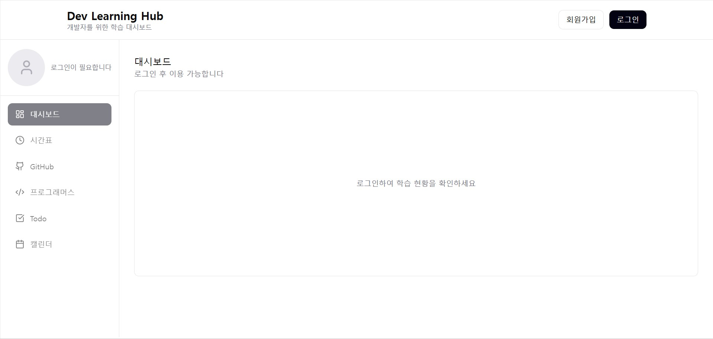

맨 처음 웹으로 접속을 하게 된다면 위와 같은 화면이 나오게 된다. 이 상태에서는 프로필부터 캘린더까지 모든 기능이 비활성화된 상태이기 때문에 회원가입과 로그인 버튼을 제외한 다른 버튼을 클릭한다고 해도 실행이 되지 않는다. 따라서 로그인을 하기 위해 회원가입을 하는 과정을 걸쳐야 한다.

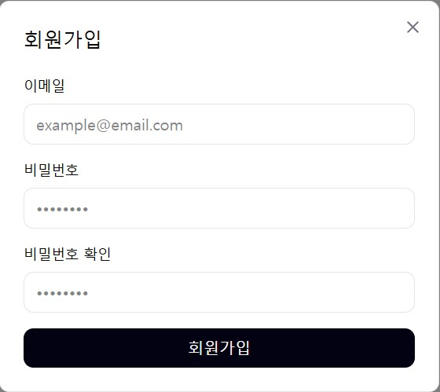

회원가입 버튼을 클릭할 시 위와 같은 입력창이 화면에 나오게 되며 이메일, 비밀번호, 비밀번호 확인을 입력받게 된다. 모든 정보를 입력받지 않으면 회원가입 버튼은 비활성화가 되며 만약 회원가입 버튼을 누를 때 이메일 입력란에 이메일 형식이 아니라면 이메일 형식으로 입력해달라는 에러메시지가 나오게 되고 비밀번호와 비밀번호 확인이 같지 않다면 마찬가지로 에러메시지가 나오게 된다.

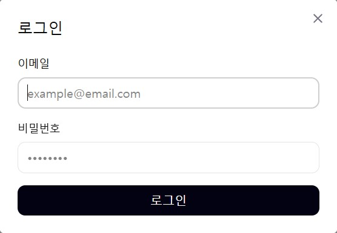

로그인 버튼을 누를시 위 사진과 같은 입력창이 나오게 되고 이메일과 비밀번호를 입력받게 된다. 회원가입과 마찬가지로 모두 입력을 하지 않으면 로그인 버튼은 비활성화가 된 상태로 있으며 이메일 형식이 맞지 않은채 로그인 버튼을 누르면 에러 메시지가 나타난다.

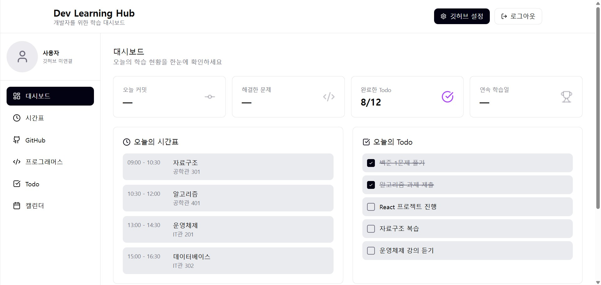

정상적으로 로그인이 되면 이와 같은 화면이 나타나게 된다.

---

### 4.2. 프로필 변경

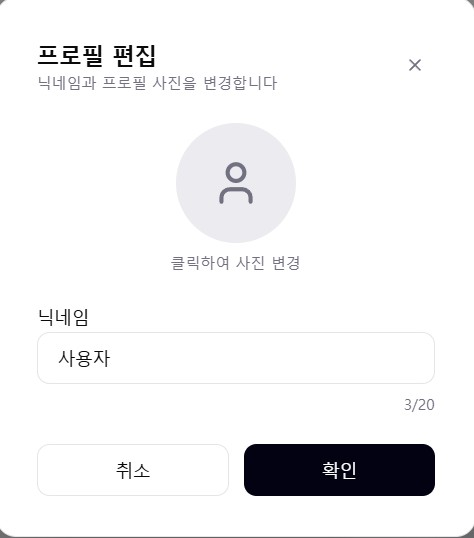

메인 대시보드에서 프로필 사진을 클릭할 시 다음과 같이 프로필을 편집할 수 있는 입력창이 나타나게 된다. 여기서 닉네임을 입력받거나 사진을 첨부하여 프로필을 변경할 수 있다.

---

### 4.3. 시간표

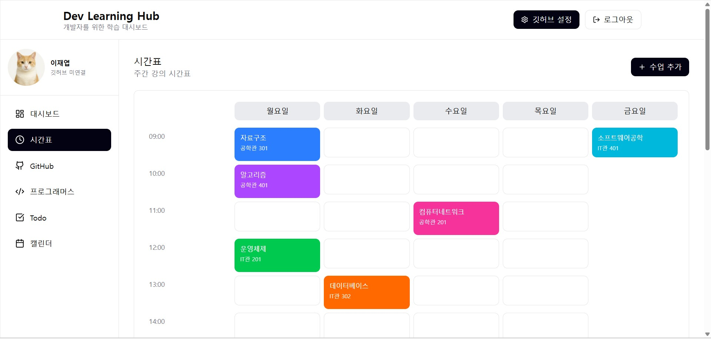

시간표 화면을 보기 위해서는 좌측의 레이아웃에서 시간표라는 버튼을 클릭하면 위 사진과 같이 시간표를 볼 수 있다. 또한 시간표를 추가하고싶다면 우측의 수업 추가버튼을 누르고 필요한 내용을 기입하고 확인 버튼을 누르면 되며

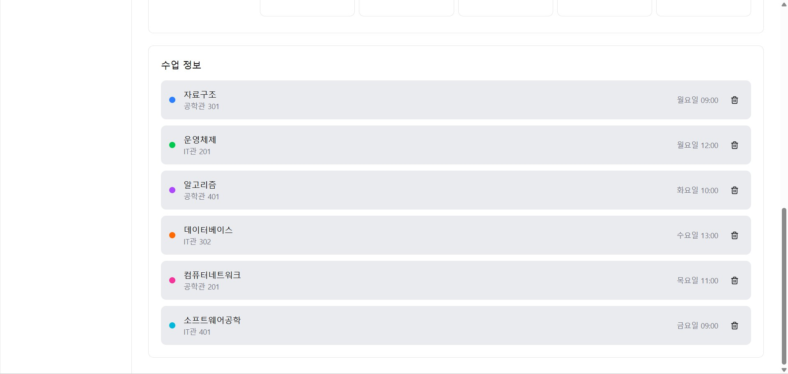

수업 일정을 삭제하고 싶다면 스크롤을 내려 수업 일정 우측의 휴지통 버튼을 클릭함으로서 시간표를 변경할 수 있다.

---

### 4.4. To Do list

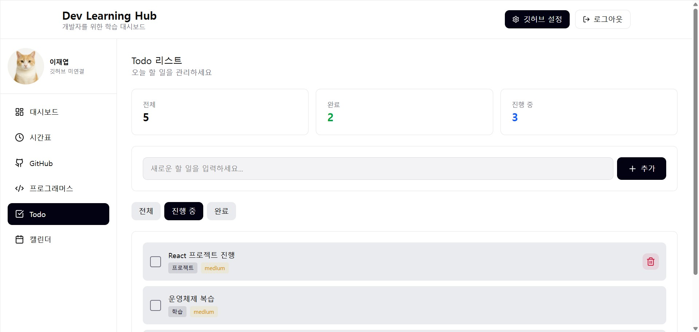

To-do list 기능을 사용하고싶다면 우측 레이아웃의 Todo 버튼을 클릭함으로써 사용할 수 있다. 추가 같은 경우에는 할 일을 입력하고 추가버튼을 클릭할 시 아래의 To-do list에 반영이 되고 시간표와 마찬가지로 우측의 휴지통 버튼을 눌러 할 일을 삭제할 수 있다. 기본적으로 완료할 할 일은 좌측의 체크박스를 클릭함으로써 상태를 바꿀 수 있다.

---

### 4.5. 캘린더

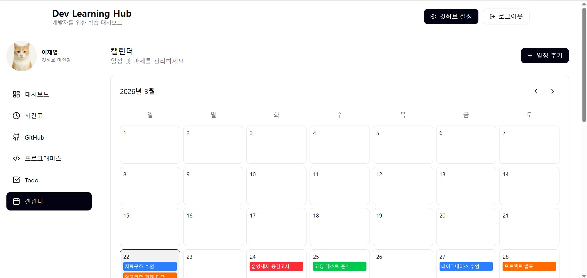

캘린더 기능도 좌측 레이아웃에서 캘린더 버튼을 클릭할 시 캘린더 화면으로 이동하며 시간표와 마찬가지로 일정 추가를 하고싶다면 필요한 내용을 입력하면 캘린더에 반영이 된다.

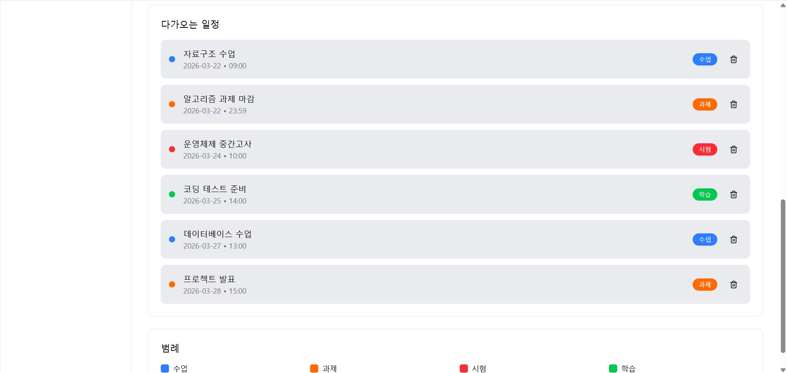

삭제도 다가오는 일정 섹션에서 우측의 휴지통 버튼을 누른다면 일정이 삭제되어 캘린더 화면에 반영이 되도록 하였다.

---

### 4.6. GitHub

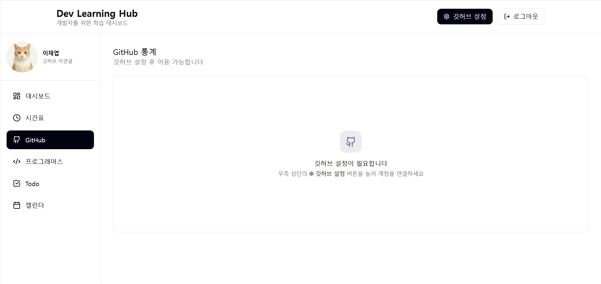

깃허브 설정이 되지 않은 상태로 좌측 레이아웃에서 GitHub 버튼을 클릭할 시 위 사진과 같이 깃허브 설정이 필요하다는 메시지가 출력되며 다른 기능은 프로그래머스 기능 또한 깃허브 설정이 없다면 위와 같은 화면이 출력된다.

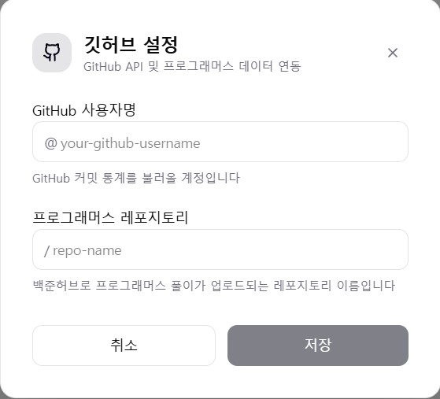

상단의 깃허브 설정을 클릭할 시 위 사진과 같이 GitHub 사용자명과 프로그래머스 레포지토리를 입력받게 된다. 두가지 정보를 입력하지 않으면 저장버튼은 비활성화되며 모두 입력하고 저장버튼을 클릭시 시스템이 검증을 걸치고 만약 정상적이라면 이 데이터가 메인 대시보드, 깃허브, 프로그래머스 화면에 반영된다.

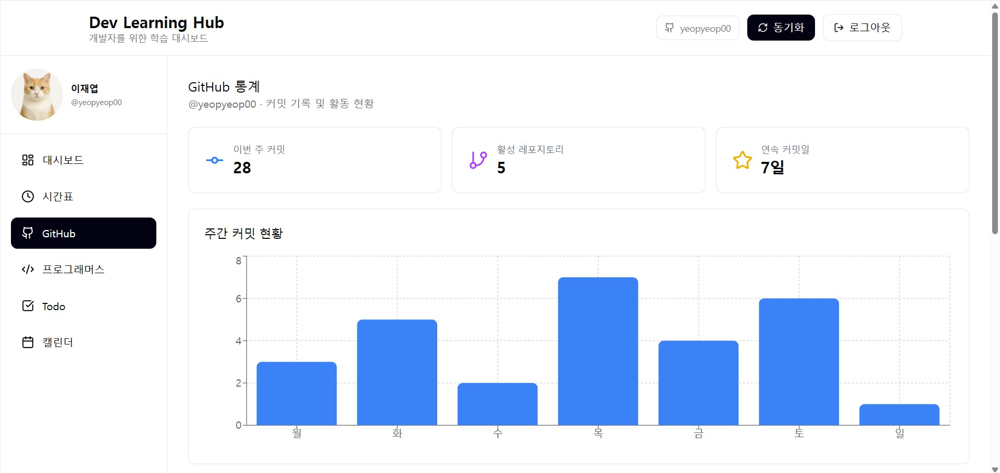

깃허브 연동이 끝이 난다면 GitHub기능 화면에는 다음과 같이 이번 주 커밋, 활성 레포지토리, 연속 커밋일, 주간 커밋 현황과 같은 통계가 나타나게 된다.

---

### 4.7. 프로그래머스

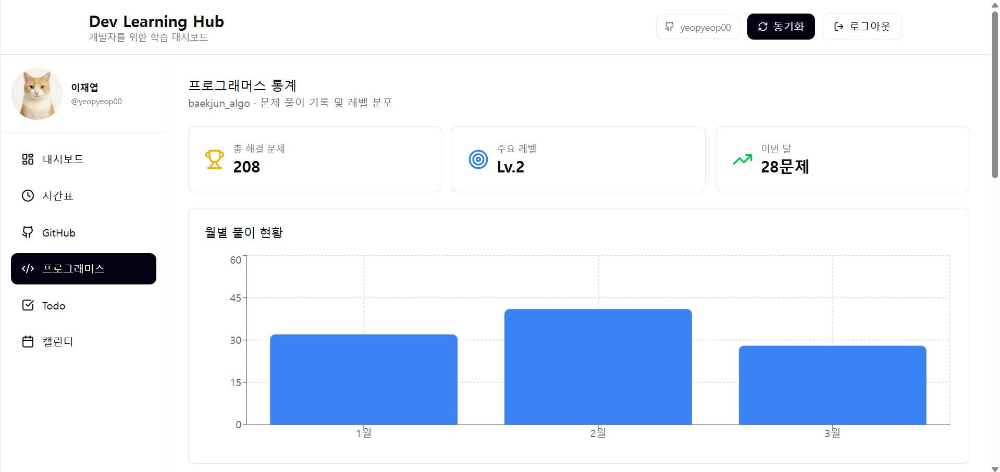

프로그래머스에서도 깃허브 설정이 끝난 뒤 좌측 레이아웃에서 프로그래머스 버튼을 클릭할 시 위와 같은 화면이 나타나게 된다. 이 화면에서는 프로그래머스 총 해결 문제, 푸는 문제들의 주요 레벨, 이번달에 푼 문제 개수, 월변 풀이 현황에 대한 통계를 나타낸다.

---

### 4.8. 동기화

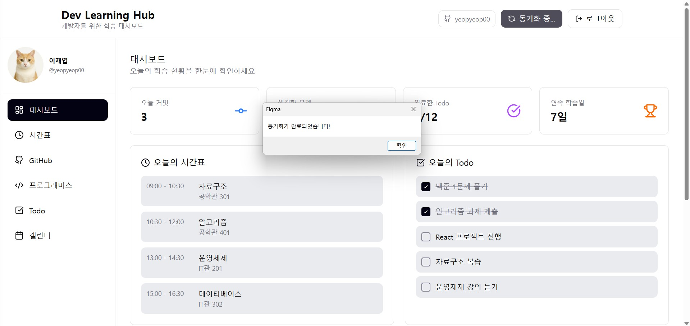

데이터 동기화는 어떤 화면이던지 상단의 동기화 버튼을 클릭함으로써 실행시킬 수 있고 GitHub API를 통해 데이터를 받아오는 것에 시간이 걸리니 동기화 버튼은 동기화 중이라는 버튼으로 바뀌어 있다가 이후 동기화가 끝나면 팝업 메시지를 통해 동기화가 완료되었다는 메시지를 출력한다.

---

## 5. Glossary

| Terms | Description |
|-------|-------------|
| 4차 산업혁명 | 인공지능(AI), 빅데이터, 사물인터넷(IoT) 등 첨단 정보통신기술이 경제와 사회 전반에 융합되어 나타나는 혁신적인 변화 |
| 알고리즘 | 어떤 문제를 해결하기 위해 정해진 일련의 절차나 규칙 |
| 코딩테스트 | 개발자의 논리적 사고와 프로그래밍 능력을 검증하기 위해 알고리즘 문제를 풀게 하는 시험 |
| GitHub API | 개발자용 플랫폼인 GitHub의 기능을 외부 프로그램에서도 사용할 수 있도록 제공하는 인터페이스 |
| Dom | 웹 페이지의 콘텐츠(HTML)를 프로그래밍 언어가 이해할 수 있는 트리 형태의 구조로 만든 모델 |
| DB | 데이터를 효율적으로 저장, 관리, 조회하기 위해 체계적으로 모아놓은 데이터의 집합소 |
| 백준 | 국내에서 가장 유명한 알고리즘 문제 풀이 사이트 중 하나로, 다양한 난이도의 문제를 제공한다. 하지만 현재는 서비스가 종료되었다. |
| 프로그래머스 | 실무 중심의 코딩 테스트 문제와 교육 과정을 제공하는 플랫폼으로, 많은 기업의 채용 시험에 활용된다. |
| 동기화 | 여러 기기나 시스템 간의 데이터가 동일하게 유지되도록 일치시키는 과정 |
| 팝업 메시지 | 현재 작업 중인 화면 위에 별도의 작은 창으로 나타나 사용자에게 정보를 알리거나 확인을 받는 메시지 |
| 에러 메시지 | 프로그램 실행 중 문제가 발생했을 때, 그 원인과 상태를 사용자나 개발자에게 알려주는 안내 문구 |

---

## 6. References

- StarUML 사용 설명서: https://docs.staruml.io/
- Figma 사용 설명서: https://help.figma.com/hc/ko

