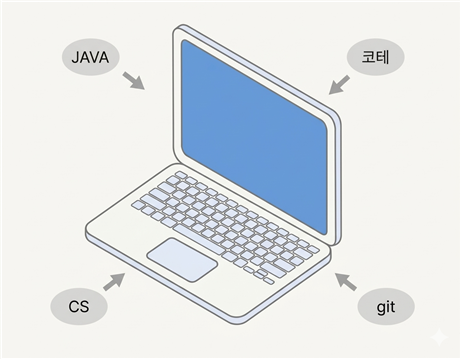
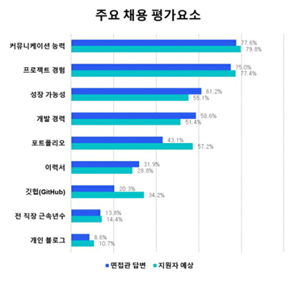
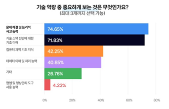
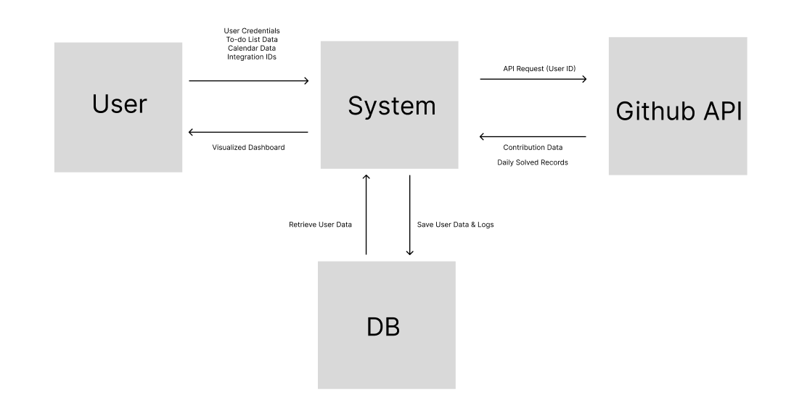

    

# Dev Learning Hub
### -Conceptualization document-

  

  

#### 22112074
#### 이재엽
#### <dlwoduq0@naver.com>

  

 
 

### [ Revision history ]

| Revision date | Version # | Description | Author |
| :--- | :---: | :---: | :--- |
| | 1.0.0 | First Concept document | |
| | | | |
| | | | |
| | | | |
| | | | |
| | | | |

  

 

## = Contents =

  

1. **Business purpose** ...........................................................................................
2. **System context diagram** ...........................................................................
3. **Use case list** ......................................................................................................
4. **Concept of operation** .................................................................................
5. **Problem statement** ......................................................................................
6. **Glossary** .............................................................................................................
7. **References** ........................................................................................................

    

# 1. Business purpose

   
  
   
  <em>[그림 1] 개발자 주요 채용 평가요소 &nbsp;&nbsp;&nbsp;&nbsp;&nbsp;&nbsp;&nbsp; [그림 2] 요구되는 기술 역량</em>

  

기술의 발전과 함께 가장 빠르게 바뀌고 있는 것은 개발자 시장이다. 코로나 팬데믹 당시 가장 인기있던 직업이었던 개발자는 어느 순간 생성형 AI의 발달로 인해 누구나 손쉽게 SW를 만들 수 있게 됨에 따라 점차 개발자에게 요구되어지는 역량의 수준도 점차 높아지고 있다. 그렇게 오늘날 신입 개발자에게는 기본적인 언어 능력, 코딩 테스트 실력, 전공 CS, 프로젝트 제작, 배포, 운영 경험과 커뮤니케이션 능력 등 많은 것을 증명해야지 개발자 취업시장에서 경쟁력을 가질 수 있게 되었다.
이런 상황속에서 컴퓨터공학과의 학생으로써 짧은 2년이라는 시간동안 최대한의 성장을 이끌어내기 위해서 앞으로 걸어갈 발걸음을 기록하고 이런 공부를 지속할 수 있도록 도움을 받고 싶어 이 프로젝트를 제작하게 되었다.
이 프로젝트는 컴퓨터공학과 학생들에게 취업을 위해 요구되는 역량인 프로젝트 제작, 코딩테스트 실력, 대학교 학업을 도와주는 시간표와 to-do list, 달력 기능을 제공함으로써 전공 CS 지식의 증대를 기대하고 있으며 더 나아가 지금까지 자신이 걸어온 길을 보며 앞으로도 공부를 지속할 원동력으로써 힘을 보태줄 학습 보조 프로그램이 되어줄 것이다.

  

# 2. System context diagram

   
  
   

### [ System Context List ]

| Data / Request Item | Description |
| :--- | :--- |
| **User Credentials** | 로그인 / 회원가입 정보 입력 |
| **To-do List Data** | 투두 리스트 입력 및 수정 |
| **Calendar List Data** | 달력 정보 입력 및 수정 |
| **Integration IDs** | 외부 연동용 깃허브, 백준, 에브리타임 ID |
| **Visualized Dashboard** | 통합 대시보드 화면 |
| **API Request (User ID)** | 커밋 기록 요청 / 문제 풀이 기록 요청 |
| **Contribution Data** | 일일 커밋 및 잔디 데이터 |
| **Daily Solved Records** | 일일 문제 풀이 성공 기록 |
| **Save User Data & Logs** | 사용자 정보, 포인트 로그, 투두 데이터 저장 |
| **Retrieve User Data** | 저장된 정보 불러오기 |

  

# 3. Use case list

1) 회원가입

| **Actor** | User |
| :--- | :--- |
| **Description** | 사용자가 서비스를 이용하기 위해서 회원등록을 한다. |

 

2) 로그인

| **Actor** | User |
| :--- | :--- |
| **Description** | 사용자가 아이디와 비밀번호를 입력받음과 동시에 검증을 거친 후 검증 여부에 따라 서비스를 이용하게 한다. |

 

3) 메인 대시보드 조회

| **Actor** | User |
| :--- | :--- |
| **Description** | to-do list, 오늘의 시간표, 오늘 커밋 수, 해결한 문제등 여러 기능의 데이터를 한눈에 살펴볼 수 있으며 좌측에 프로필 또한 확인할 수 있다.|

 

4) 프로필 설정

| **Actor** | User |
| :--- | :--- |
| **Description** | 사용자의 닉네임과 상태메세지 확인 및 설정이 가능하다. |

 

5) 깃허브 설정

| **Actor** | User |
| :--- | :--- |
| **Description** | 사용자의 깃허브 계정과 문제 풀이 내역 레포지토리를 입력받음으로써 깃허브 통계 화면, 프로그래머스 문제 풀이 통계 화면 조회 기능을 활성화 시킨다.|

 

6) 시간표 조회

| **Actor** | User |
| :--- | :--- |
| **Description** | 직접 입력한 시간표를 조회할 수 있다. 이 때 시간표는 각 강의별로 다른 색상을 사용하며 강의와 강의실을 모두 표기하도록 한다. |

 

7) 시간표 일정 추가

| **Actor** | User |
| :--- | :--- |
| **Description** | 시간표를 직접 추가할 수 있도록 한다. 추가와 같은 경우에는 수업명, 강의실, 요일, 시간, 색상을 입력받아 이를 시간표에 반영할 수 있도록 한다. |

 

8) 시간표 일정 삭제

| **Actor** | User |
| :--- | :--- |
| **Description** | 시간표를 삭제할 수 있도록 한다. 시간표 일정 목록의 우측에 있는 삭제 버튼을 클릭함으로써 삭제할 수 있다. |

 

9) to-do 리스트 조회

| **Actor** | User |
| :--- | :--- |
| **Description** | to-do 리스트의 목록을 확인할 수 있다. 모든 list의 내용은 전체, 진행중, 완료로 3개의 카테고리별로 나누어 확인할 수 있다. |

 

10) to-do 리스트 추가

| **Actor** | User |
| :--- | :--- |
| **Description** | to-do 리스트에 할 일을 추가할 수 있다. to-do 리스트 화면에서 입력창에 할 일을 입력하고 추가 버튼을 클릭함으로써 리스트에 즉각적으로 반영한다. | 

 

11) to-do 리스트 삭제

| **Actor** | User |
| :--- | :--- |
| **Description** | to-do 리스트에 할 일을 삭제할 수 있다. to-do 리스트의 각각의 할 일 우측에는 삭제 버튼이 있는데 이 버튼을 클릭함으로써 리스트에 삭제가 되었음을 반영한다. | 

 

12) Calendar 조회

| **Actor** | User |
| :--- | :--- |
| **Description** | 사용자가 직접 추가한 달력의 일정을 확인할 수 있다. 이 때 일정은 시간표와 마찬가지로 다른 색상을 부여해 좀 더 눈에 띌 수 있게 한다. |

 

13) Calendar 일정 추가

| **Actor** | User |
| :--- | :--- |
| **Description** | 달력 화면에서 일정 추가 버튼을 클릭하고 제목, 날짜, 시간, 유형을 입력받아 일정을 추가할 수 있으며 즉각적으로 달력에 반영된다.|

 

14) Calendar 일정 삭제

| **Actor** | User |
| :--- | :--- |
| **Description** | 하단의 일정 목록에서 각 일정의 우측에 있는 삭제 버튼을 클릭하여 삭제할 수 있다. 이 또한 즉각적으로 달력에 반영된다.|

 

15) GitHub 일일 커밋 내역, 잔디 확인

| **Actor** | User |
| :--- | :--- |
| **Description** | GitHub API를 통해 받아온 데이터를 바탕으로 주간 커밋 현황, 연간 기여도, 최근 활동, 연간 잔디 등 다양한 정보를 확인할 수 있다. |

 

16) 프로그래머스 일일 문제 풀이 내역, 잔디 확인

| **Actor** | User |
| :--- | :--- |
| **Description** | GitHub API를 통해 받아온 문제 풀이 내역 통계 데이터를 바탕으로 총 해결 문제, 주요 문제 레벨, 최근 풀이 현황, 연간 잔디 등 다양한 정보를 확인할 수 있다. |

 

17) 외부 API 데이터 동기화

| **Actor** | User |
| :--- | :--- |
| **Description** | 깃허브 설정때 입력한 깃허브 계정과 문제 풀이 내역 레포지토리를 가지고 GitHub API를 통해 데이터를 동기화 한다.|

  

# 4. Concept of operation

1) 회원가입

| Purpose | 서비스를 이용할 사용자 정보 DB에 전달 |
|---|---|
| Approach | 사용자로부터 ID, 비밀번호, 닉네임을 입력받고 이 정보를 DB로 보내준다. 문제 없이 DB에 저장되었다면 성공 메시지를 띄운다. |
| Dynamics | 웹사이트에서 회원가입을 할 경우 |
| Goals | 회원가입 기능을 구현한다. |

 

2) 로그인

| Purpose | 서비스를 이용하기 위해 등록된 사용자인지 검증 |
|---|---|
| Approach | 사용자가 아이디, 비밀번호를 입력할 시 서버에서 DB에 있는 회원 정보를 조회 및 검증후 만약 가입된 회원이 맞다면 서비스를 이용할 수 있도록 한다. |
| Dynamics | 웹사이트에서 로그인할 경우 |
| Goals | 로그인 기능을 구현한다. |

 

3) 메인 대시보드 조회

| Purpose | 자신의 프로필 및 여러 데이터 조회 가능 |
|---|---|
| Approach | to-do list, 시간표, 문제 해결 내역, 최근 커밋 내역, 프로필 등 다양한 내용을 한 눈에 볼 수 있다.|
| Dynamics | 성공적으로 로그인을 할 경우 |
| Goals | 메인 대시보드 기능을 구현한다. |

 

4) 프로필 수정

| Purpose | 자신의 프로필을 수정 가능 |
|---|---|
| Approach | 메인 대시보드에서 프로필을 클릭함으로써 닉네임과 프로필 사진을 변경할 수 있다. |
| Dynamics | 메인 대시보드에서 프로필로 들어갈 경우 |
| Goals | 프로필 수정 기능을 구현한다. |

 

5) 깃허브 설정

| Purpose | GitHub API를 통해 데이터를 받기 위한 사전 준비 |
|---|---|
| Approach | 메인 대시보드 상단의 깃허브 설정 버튼을 클릭하고 깃허브 계정과 문제 해결 내역 레포지토리를 입력하여 GitHub API를 통해 깃허브 기능과 프로그래머스 기능을 위한 데이터를 받아온다. |
| Dynamics | 메인 대시보드에서 깃허브 설정 버튼을 클릭 시 |
| Goals | 깃허브 API 연동이 정상적으로 될 수 있도록 한다. |

 

6) 시간표 조회

| Purpose | 직접 작성한 시간표 조회 |
|---|---|
| Approach | DB에 저장된 시간표 데이터를 불러와 화면에 시각화하여 출력할 수 있도록 한다. |
| Dynamics | 메인 대시보드의 좌측 목록 중 시간표를 클릭시 |
| Goals | 시간표 조회 기능을 구현한다 |

 

7) 시간표 일정 추가

| Purpose | 시간표 일정 추가 |
|---|---|
| Approach | 시간표 화면에서 수업 추가 버튼을 클릭해 수업, 강의실, 요일, 시간, 색상을 입력함으로써 시간표에 반영할 수 있도록 한다. |
| Dynamics | 시간표 화면에서 수업 추가 버튼 클릭 시 |
| Goals | 시간표 일정 추가 기능을 구현한다. |

 

8) 시간표 일정 삭제

| Purpose | 시간표 일정 삭제|
|---|---|
| Approach | 시간표 화면의 수업 일정 목록의 우측에 있는 삭제 버튼을 클릭함으로써 시간표에 반영할 수 있도록 한다.  |
| Dynamics | 시간표 수업 일정 목록에서 삭제 버튼 클릭시 |
| Goals | 시간표 일정 삭제 기능을 구현한다. |

 

9) to-do 리스트 조회

| Purpose | to-do 리스트 조회 |
|---|---|
| Approach | DB에 저장된 to-do리스트의 데이터를 가져와 전체, 진행중, 완료로 3가지의 카테고리별로 나눠 to-do 리스트의 내용을 확인할 수 있다. |
| Dynamics | 메인 대시보드의 좌측 목록 중 to-do list를 클릭 할 시 |
| Goals | to-do 리스트를 카테고리별로 조회할 수 있도록 구현한다. |

 

10) to-do 리스트 추가

| Purpose | to-do 리스트 추가 |
|---|---|
| Approach | 각각의 리스트의 내용을 to-do 리스트 화면에서 할 일을 입력하고 추가 버튼을 클릭하면 해당 내용이 to-do list에 반영된다. |
| Dynamics | to-do list 화면에서 할 일을 입력하고 추가 버튼을 클릭시 |
| Goals | to-do 리스트 추가 기능을 구현한다. |

 

11) to-do 리스트 삭제

| Purpose | to-do 리스트 삭제 |
|---|---|
| Approach | 할 일 목록의 각각의 할 일 우측의 삭제버튼을 클릭함으로써 to-do list에 내용이 반영될 수 있도록 한다. |
| Dynamics | to-do list 화면에서 할 일 우측에 있는 삭제 버튼 클릭시 |
| Goals | to-do 리스트 삭제 기능을 구현한다. |

 

12) Calender 조회

| Purpose | Calendar 페이지 조회 |
|---|---|
| Approach | DB에 저장된 내용을 가져와 색상별로 구분된 일정을 달력에 띄워 확인할 수 있도록 한다. |
| Dynamics | 메인 대시보드의 좌측 목록중 Calendar 버튼 클릭시 |
| Goals | Calendar을 조회할 수 있도록 구현한다. |

 

13) Calendar 일정 추가

| Purpose | Calendar 페이지 추가 |
|---|---|
| Approach | Calendar 페이지에서 일정 추가버튼을 누르고 제목, 날짜, 시간, 유형을 선택하여 입력할 시 해당 내용이 DB로 전달됨과 동시에 화면에 띄워줄 수 있도록 한다. |
| Dynamics | Calendar 화면에서 일정추가 버튼 클릭 시 |
| Goals | Calendar 일정 관리를 위한 추가 기능을 구현한다. |

 

14) Calendar 일정 삭제

| Purpose | Calendar 페이지 삭제 |
|---|---|
| Approach | 일정 내역 목록의 옆의 휴지통 버튼을 클릭함으로써 해당 일정을 삭제할 수 있도록 한다. 해당 내용이 DB로 전달됨과 동시에 화면에 띄워줄 수 있도록 한다. |
| Dynamics | Calendar 화면에서 일정추가 삭제 버튼 클릭 시 |
| Goals | Calendar 일정 관리를 위한 삭제 기능을 구현한다. |

 

15) GitHub 일일 커밋 내역, 잔디 확인

| Purpose | GitHub 커밋 기록 조회 |
|---|---|
| Approach | DB에 저장된 GitHub ID를 가지고 api를 통해 불러온 데이터를 화면으로 띄울 수 있도록 한다. |
| Dynamics | 메인 대시보드의 좌측 목록중 GitHub 버튼 클릭시 |
| Goals | github 커밋 기록을 조회 기능을 구현한다. |

 

16) 프로그래머스 일일 문제풀이 내역, 잔디 확인

| Purpose | 프로그래머스 문제풀이 내역 조회 |
|---|---|
| Approach | DB에 저장된 문제 풀이 내역 레포지토리를 가지고 api를 통해 불러온 데이터를 화면으로 띄울 수 있도록 한다. |
| Dynamics | 메인 대시보드의 좌측 목록중 프로그래머스 버튼 클릭시 |
| Goals | 프로그래머스 문제 풀이 내역 조회 기능을 구현한다. |

 

17) 외부 API 데이터 동기화

| Purpose | GitHub, 프로그래머스와의 데이터 동기화 |
|---|---|
| Approach | 깃허브 설정을 통해 DB에 저장된 깃허브 계정과 문제 풀이 내역 레포지토리를 가지고 GitHub API를 통해서 데이터를 동기화 시켜줄 수 있도록 한다. |
| Dynamics | 메인 대시보드에서 API 동기화 버튼 클릭 시 |
| Goals | API 동기화 기능을 구현한다. |

  

# 5. Problem statement

Dev Learning Hub는 시간표, to-do list, 달력, 프로그래머스, 깃허브등 5가지 기능을 기반으로 개발자를 지망하는 컴퓨터공학과 학생들이 앞으로 개발자로써 필요한 필수적인 역량을 키우는데 도움이 될 학습 보조 프로그램이다. 이러한 학습 보조 프로그램이 성공적으로 제작되려면 다음과 같은 Problem statement가 필요하다.

Problem #1
역량을 키우는 것에 있어서 가장 필수적인 것은 꾸준한 학습을 지속하는 것이다. 이때 꾸준한 학습을 지향하도록 이끌어주는 원동력과 같은 것이 필요한데 이 프로그램에서는 성취감을 이용하도록 하였다. 즉, 사용자가 지금까지 걸어온 자신의 발자취를 보고 앞으로 걸어갈 힘을 얻게 하도록 하고자 하였다. 이 부분에 있어 가장 중요하다고 생각되는 부분은 백준과 깃허브 기능인데 이 두 기능이 모두 안정적으로 작동하기 위해서 다른 데이터 형식과 호출 제한을 고려하여, 사용자 데이터를 누락 없이 동기화할 수 있도록 설계하는 것에 초점을 맞출 것이다.

Problem #2
프로그램의 다양한 기능중에는 시간표, to-do list, 달력과 같이 해야할 일을 시각적으로 보여주는 기능이 많다. 그러한 기능을 사용해 내용을 이해할 때에도, 사용할 때에도 사용자 편의성을 위해서 직관적으로 알 수 있어야 한다. 그렇기에 이 프로그램에서는 에브리타임과 카카오톡의 캘린더를 참조한 디자인을 구상할 것이며 일정을 추가할 때에는 +버튼을, 삭제할 때에는 휴지통 아이콘을 사용한 버튼을 씀으로써 직관적으로 버튼을 사용할 수 있도록 할 것이다.

  

# 6. Glossary

| Term | Description |
|---|---|
| 전공 CS | Computer Science의 약자로, 컴퓨터 과학의 전반적인 이론을 의미한다. |
| 코딩테스트 | 기업 채용 시 지원자의 프로그래밍 역량과 문제 해결 능력을 평가하기 위해 실시하는 알고리즘 구현 시험. |
| 깃허브 | 프로젝트의 소스 코드를 호스팅하고, 협업 및 오픈소스 공유를 지원하는 플랫폼. |
| 프로그래머스 | 실무 중심의 코딩 테스트 문제와 교육 과정을 제공하는 플랫폼으로, 많은 기업의 채용 시험에 활용된다. |
| 잔디 데이터 | 깃허브, 백준의 활동기록이 달력형태로 시각화되어 표시된 것을 말한다. |
| DB | Database의 약자로, 여러 사용자가 공유하여 사용할 목적으로 체계적으로 정리하여 저장된 데이터의 집합 |
| HTML | HyperText Markup Language의 약자로, 웹페이지 구조와 내용을 정의하기 위해 사용되는 표준 마크업 언어이다. |

  

# 7. References
[그림 1] : https://zdnet.co.kr/view/?no=20230125092740
 
[그림 2] : https://byline.network/2025/02/27-431/