

    

# Dev Learning Hub 
### -Analysis-

  

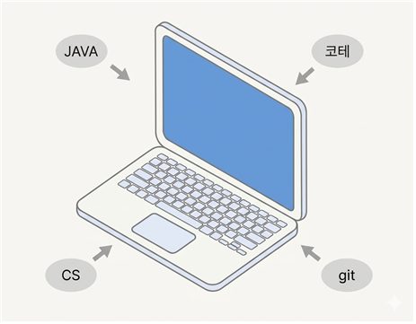

#### 22112074
#### 이재엽 
#### dlwoduq0@naver.com

  

---

## [ Revision history ]

| Revision date | Version # | Description | Author |
|:---:|:---:|:---:|:---:|
| 06/03/2026 | 1.0 | 초기버전 | |
| | | | |
| | | | |
| | | | |
| | | | |
| | | | |

---

## = Contents =

1. Introduction
2. Class diagram
3. Sequence diagram
4. State machine diagram
5. Implementation requirements
6. Glossary
7. References

---

## 1. Introduction

### 1) Executive Summary

현재 세계는 4차산업혁명을 맞이하여 비약적인 기술의 발전을 통해 시장의 많은 것들이 급격하게 변화하고 있는 상황이다. 이러한 시장의 중심에 있는 것은 바로 IT인력으로 AI가 새롭게 나오게 됨에 따라서 앞으로 컴퓨터 공학을 졸업하고 개발자로써 나아갈 컴퓨터 공학과 학생들에게 요구되어지는 역량 또한 나날이 갈수록 높아지고 있는 상황이다. 따라서 컴퓨터 공학 지식, 알고리즘 코딩테스트, 프로젝트 경험등 많은 측면에서 학생들의 여러 역량을 끌어올리는 것에 도움이 될 수 있도록 Dev learning Hub라는 이 프로그램을 개발하게 되었다.

### 2) Business Goals

대학생으로 가장 역량을 끌어올리는 것에 있어 가장 중요한 기준은 바로 기본에 충실하여 꾸준히 나아가는 것이라고 생각한다. 성을 쌓을 때도 기반이 튼튼하지 않고 계속 쌓다간 무너지듯이 기반을 제대로 다져놓지 않고 새로운 기술을 받아들이려 한다면 얼마안가 무너질 것이다. 따라서 현재 대학 교육 커리큘럼에 따라 차근차근 학습을 진행할 수 있도록 시간표와 달력 기능, to-do list기능을 통해 계획 설정 및 목표를 설정하고 나아갈 수 있도록 하며 또한 Github 활동 내역, 코딩테스트 문제 풀이 내역을 확인하며 교과과정 외의 개발자로써 필요한 역량을 얻기 위해 목표 설정이 가능할 수 있도록 하였다. 이렇게 목표를 설정하고 성취를 이뤄낸다면 이 또한 꾸준한 학습을 하는 것에 좋은 동기부여가 되어줄 수 있을 것이다.

### 3) Technical Goals

이 프로젝트에서는 기본적으로 Github API, solved.ac API를 통해 데이터를 받아옴으로써 기능을 구현하고자 했으나 백준 웹사이트가 서비스를 종료하게 됨에 따라서 백준이 아닌 프로그래머스의 문제풀이내역을 가져오고자 하였다. 하지만 프로그래머스는 별도로 API가 없기에 크롬의 웹 확장 프로그램인 백준 허브라는 프로그램이 프로그래머스에서 문제를 풀 시, Dom감지에 따라 즉각적으로 연동된 Github상의 레포지토리에 문제 풀이 내역을 올려준다는 것을 활용해 문제 풀이 내역 또한 Github API를 통해 성공적으로 받아오고자 한다. 이러한 내용 또한 Github ID와 문제풀이내역이 저장될 레포지토리가 정상적으로 DB에 저장된다면을 가정했을 때의 내용이니 시간표, 달력, to-do list등 전반적으로 DB가 정상적으로 저장되고 사용될 수 있도록 하게 할 것이다.

---

## 2. Class diagram

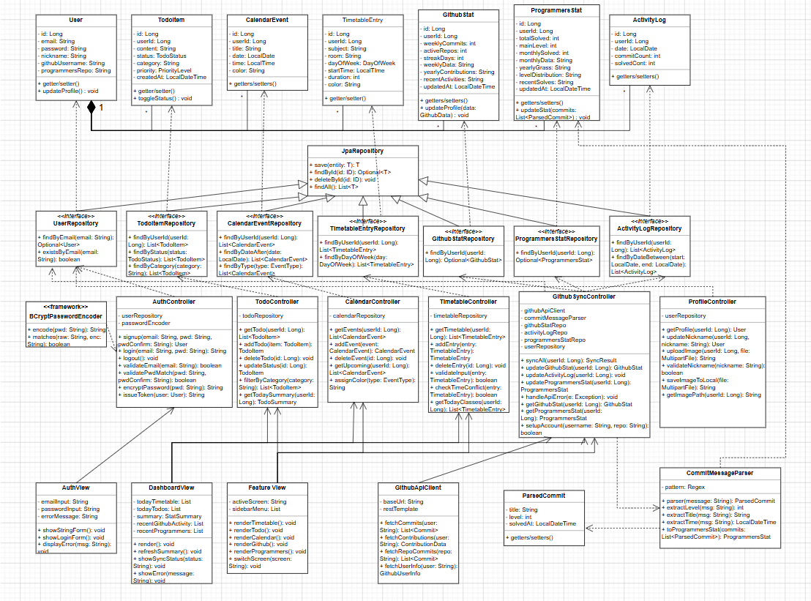

아래의 표는 위의 클래스 다이어그램의 각각의 클래스에 대한 설명이다.

| class | explanation |
|:---:|---|
| User | 시스템에 가입한 사용자 정보를 저장하는 클래스다. 이메일과 비밀번호로 인증을 처리하며, GitHub 연동을 위한 사용자명과 프로그래머스 레포지토리 정보를 함께 관리한다. - getter/setter(): 각 속성의 값을 반환하거나 설정하는 메서드다. - updateProfile(): void: 사용자의 닉네임, 프로필 이미지 경로 등 프로필 정보를 갱신하는 메서드다. |
| TodoItem | 사용자의 할 일 항목 하나를 나타내는 클래스다. 할 일의 내용, 완료 상태, 카테고리, 우선순위를 저장하며 생성 시각을 함께 기록한다. - getter/setter(): 각 속성의 값을 반환하거나 설정하는 메서드다. - toggleStatus(): void: 할 일 항목의 완료 상태를 전환하는 메서드다. 미완료 상태이면 완료로, 완료 상태이면 미완료로 변경한다. |
| CalendarEvent | 달력에 등록된 일정 하나를 나타내는 클래스다. 날짜와 시각, 일정 종류에 따라 부여된 색상을 함께 저장한다. - getters/setters(): 각 속성의 값을 반환하거나 설정하는 메서드다. |
| TimetableEntry | 주간 시간표의 수업 항목 하나를 나타내는 클래스다. 요일, 강의실, 시작 시각, 수업 시간(분 단위)을 저장해 시간표를 구성한다. - getter/setter(): 각 속성의 값을 반환하거나 설정하는 메서드다. |
| GithubStat | GitHub 활동 통계를 저장하는 클래스다. 주간 커밋 수, 활성 레포지토리 수, 연속 커밋 일수 등 GitHub 활동 화면에 표시되는 통계 데이터를 관리한다. - getters/setters(): 각 속성의 값을 반환하거나 설정하는 메서드다. - updateProfile(data: GithubData): GitHub API로부터 가져온 최신 활동 데이터를 바탕으로 통계 정보를 갱신하는 메서드다. |
| ProgrammersStat | 백준허브를 통해 수집된 알고리즘 문제 풀이 통계를 저장하는 클래스다. 총 풀이 수, 메인 레벨, 월별 풀이 수, 레벨 분포, 연간 잔디 등 프로그래머스 화면에 표시되는 모든 통계를 관리한다. - getters/setters(): 각 속성의 값을 반환하거나 설정하는 메서드다. - updateStat(commits: List\<ParsedCommit\>): 파싱된 커밋 목록을 받아 총 풀이 수, 레벨 분포, 월별 통계 등 문제 풀이 관련 통계 데이터를 갱신하는 메서드다. |
| ActivityLog | 날짜별 활동 기록을 저장하는 클래스다. 특정 날짜의 커밋 수와 문제 풀이 수를 기록하여 일별 활동 추이를 조회할 수 있게 한다. - getters/setters(): 각 속성의 값을 반환하거나 설정하는 메서드다. |
| UserRepository | 사용자 정보를 데이터베이스에서 조회하고 저장하는 인터페이스다. 이메일 기반의 사용자 조회와 중복 가입 방지를 위한 이메일 존재 여부 확인 기능을 제공한다. - findByEmail(email: String): Optional\<User\>: 이메일 주소로 사용자를 조회하는 메서드다. 해당 이메일을 가진 사용자가 없을 수도 있으므로 Optional로 반환한다. - existsByEmail(email: String): boolean: 입력한 이메일이 이미 등록되어 있는지 여부를 확인하는 메서드다. 회원가입 시 중복 이메일 검사에 사용된다. |
| TodoItemRepository | 할 일 항목을 데이터베이스에서 조회하고 저장하는 인터페이스다. 사용자별 조회 외에도 상태와 카테고리 기준의 필터링 조회를 지원한다. - findByUserId(userId: Long): List\<TodoItem\>: 특정 사용자의 모든 할 일 항목을 조회하는 메서드다. - findByStatus(status: TodoStatus): List\<TodoItem\>: 완료, 미완료 등 특정 상태의 할 일 항목만 필터링하여 조회하는 메서드다. - findByCategory(category: String): List\<TodoItem\>: 특정 카테고리에 해당하는 할 일 항목만 필터링하여 조회하는 메서드다. |
| CalendarEventRepository | 달력 일정을 데이터베이스에서 조회하고 저장하는 인터페이스다. 사용자별 전체 일정 조회 외에도 날짜 이후의 일정이나 특정 유형의 일정만 조회하는 기능을 제공한다. - findByUserId(userId: Long): List\<CalendarEvent\>: 특정 사용자의 모든 일정을 조회하는 메서드다. - findByDateAfter(date: LocalDate): List\<CalendarEvent\>: 특정 날짜 이후의 일정만 조회하는 메서드다. 다가오는 일정 목록을 표시할 때 사용된다. - findByType(type: EventType): List\<CalendarEvent\>: 특정 유형에 해당하는 일정만 필터링하여 조회하는 메서드다. |
| TimetableEntryRepository | 시간표 항목을 데이터베이스에서 조회하고 저장하는 인터페이스다. 사용자별 전체 시간표 조회와 특정 요일의 수업만 조회하는 기능을 제공한다. - findByUserId(userId: Long): List\<TimetableEntry\>: 특정 사용자의 전체 시간표 항목을 조회하는 메서드다. - findByDayOfWeek(day: DayOfWeek): List\<TimetableEntry\>: 특정 요일에 해당하는 수업 항목만 조회하는 메서드다. 오늘의 수업 목록을 표시할 때 사용된다. |
| GithubStatRepository | GitHub 활동 통계를 데이터베이스에서 조회하고 저장하는 인터페이스다. 사용자당 하나의 통계 레코드만 존재하므로 Optional로 반환한다. - findByUserId(userId: Long): Optional\<GithubStat\>: 특정 사용자의 GitHub 활동 통계를 조회하는 메서드다. 아직 동기화된 데이터가 없을 수도 있으므로 Optional로 반환한다. |
| ProgrammersStatRepository | 알고리즘 문제 풀이 통계를 데이터베이스에서 조회하고 저장하는 인터페이스다. 사용자당 하나의 통계 레코드만 존재하므로 Optional로 반환한다. - findByUserId(userId: Long): Optional\<ProgrammersStat\>: 특정 사용자의 문제 풀이 통계를 조회하는 메서드다. 동기화 이전에는 데이터가 없을 수 있으므로 Optional로 반환한다. |
| ActivityLogRepository | 날짜별 활동 기록을 데이터베이스에서 조회하고 저장하는 인터페이스다. 사용자별 전체 기록 조회와 특정 기간 내의 기록만 조회하는 기능을 제공한다. - findByUserId(userId: Long): List\<ActivityLog\>: 특정 사용자의 전체 활동 기록을 조회하는 메서드다. - findByDateBetween(start: LocalDate, end: LocalDate): List\<ActivityLog\>: 시작 날짜와 종료 날짜 사이의 활동 기록만 조회하는 메서드다. 특정 기간의 활동 통계를 계산할 때 사용된다. |
| AuthController | 회원가입, 로그인, 로그아웃 등 사용자 인증과 관련된 모든 처리를 담당하는 클래스다. - signup(email, pwd, pwdConfirm): User: 이메일, 비밀번호, 비밀번호 확인을 입력받아 형식 검사 및 중복 확인 후 회원가입을 처리하고 생성된 사용자 객체를 반환하는 메서드다. - login(email, pwd): String: 이메일과 비밀번호를 입력받아 자격 증명을 확인하고, 인증에 성공하면 세션 토큰을 반환하는 메서드다. - logout(): void: 현재 로그인된 사용자의 세션을 종료하는 메서드다. - validateEmail(email): boolean: 입력한 이메일이 올바른 형식인지 정규식으로 검사하는 메서드다. 형식에 맞지 않으면 false를 반환한다. - validatePwdMatch(pwd, pwdConfirm): boolean: 비밀번호와 비밀번호 확인 입력값이 서로 일치하는지 검사하는 메서드다. 불일치 시 false를 반환한다. - encryptPassword(pwd): String: 입력받은 평문 비밀번호를 BCrypt 알고리즘으로 단방향 암호화하여 반환하는 메서드다. - issueToken(user): String: 인증에 성공한 사용자 객체를 바탕으로 세션 토큰을 생성하여 반환하는 메서드다. |
| ProfileController | 로그인된 사용자의 프로필 정보 조회 및 수정을 담당하는 클래스다. - getProfile(userId): User: 사용자 ID로 현재 프로필 정보를 조회하여 반환하는 메서드다. - updateNickname(userId, nickname): User: 사용자의 닉네임을 변경하고 갱신된 사용자 객체를 반환하는 메서드다. 내부적으로 validateNickname()을 호출해 형식을 먼저 검사한다. - uploadImage(userId, file): String: 프로필 이미지 파일을 입력받아 로컬에 저장하고 저장된 이미지 경로를 반환하는 메서드다. 내부적으로 saveImageToLocal()을 호출한다. - validateNickname(nickname): boolean: 닉네임이 허용된 형식(길이, 특수문자 등)에 맞는지 검사하는 메서드다. 형식에 맞지 않으면 false를 반환한다. - saveImageToLocal(file): String: 업로드된 이미지 파일을 서버 로컬 경로에 저장하고 해당 경로 문자열을 반환하는 메서드다. - getImagePath(userId): String: 특정 사용자의 프로필 이미지가 저장된 로컬 경로를 반환하는 메서드다. |
| TodoController | 할 일 목록의 조회, 추가, 삭제, 상태 변경 등 To-do 기능 전반을 담당하는 클래스다. - getTodo(userId): List\<TodoItem\>: 특정 사용자의 전체 할 일 목록을 조회하여 반환하는 메서드다. - addTodo(item): TodoItem: 새로운 할 일 항목을 데이터베이스에 저장하고 저장된 객체를 반환하는 메서드다. - deleteTodo(id): void: 특정 ID에 해당하는 할 일 항목을 삭제하는 메서드다. - updateStatus(id): TodoItem: 특정 할 일 항목의 완료 상태를 전환하고 갱신된 객체를 반환하는 메서드다. - filterByCategory(category): List\<TodoItem\>: 입력한 카테고리에 해당하는 할 일 항목만 필터링하여 반환하는 메서드다. - getTodaySummary(userId): TodoSummary: 오늘 날짜 기준의 할 일 요약 정보(총 개수, 완료 개수 등)를 반환하는 메서드다. 대시보드 화면에 표시되는 요약 데이터에 사용된다. |
| CalendarController | 달력 일정의 조회, 추가, 삭제 및 색상 배정 등 Calendar 기능 전반을 담당하는 클래스다. - getEvents(userId): List\<CalendarEvent\>: 특정 사용자의 전체 일정 목록을 조회하여 반환하는 메서드다. - addEvent(event): CalendarEvent: 새로운 일정을 데이터베이스에 저장하고 저장된 객체를 반환하는 메서드다. 내부적으로 assignColor()를 호출해 일정 유형에 맞는 색상을 배정한다. - deleteEvent(id): void: 특정 ID에 해당하는 일정을 삭제하는 메서드다. - getUpcoming(userId): List\<CalendarEvent\>: 오늘 이후의 다가오는 일정만 조회하여 반환하는 메서드다. 대시보드 화면의 일정 미리보기에 사용된다. - assignColor(type): String: 일정 유형(EventType)에 따라 적절한 색상 코드를 반환하는 메서드다. |
| TimetableController | 시간표 항목의 조회, 추가, 삭제 및 입력 검증 등 Timetable 기능 전반을 담당하는 클래스다. - getTimetable(userId): List\<TimetableEntry\>: 특정 사용자의 전체 시간표를 조회하여 반환하는 메서드다. - addEntry(entry): TimetableEntry: 새로운 수업 항목을 시간표에 추가하고 저장된 객체를 반환하는 메서드다. 내부적으로 validateInput()과 checkTimeConflict()를 순서대로 호출해 유효성을 먼저 검사한다. - deleteEntry(id): void: 특정 ID에 해당하는 수업 항목을 삭제하는 메서드다. - validateInput(entry): boolean: 수업 항목의 필수 입력값(과목명, 요일, 시작 시각 등)이 모두 채워져 있는지 검사하는 메서드다. 누락된 항목이 있으면 false를 반환한다. - checkTimeConflict(entry): boolean: 추가하려는 수업 항목이 기존 시간표와 시간이 겹치는지 확인하는 메서드다. 충돌이 있으면 false를 반환한다. - getTodayClasses(userId): List\<TimetableEntry\>: 오늘 요일에 해당하는 수업 항목만 조회하여 반환하는 메서드다. 대시보드의 오늘 시간표 표시에 사용된다. |
| GithubSyncController | GitHub API 연동, 데이터 동기화, 통계 조회 등 GitHub 관련 기능 전반을 담당하는 클래스다. - syncAll(userId): SyncResult: GitHub API로부터 최신 데이터를 가져와 GitHub 통계, 활동 로그, 프로그래머스 통계를 일괄 갱신하고 동기화 결과를 반환하는 메서드다. 내부적으로 updateGithubStat(), updateActivityLog(), updateProgrammersStat()을 순차적으로 호출한다. - updateGithubStat(userId): GithubStat: GitHub API를 호출하여 최신 커밋 수, 기여도 등의 통계 데이터를 가져와 GithubStat을 갱신하고 반환하는 메서드다. - updateActivityLog(userId): void: GitHub API를 호출하여 날짜별 커밋 수와 문제 풀이 수를 가져와 ActivityLog를 갱신하는 메서드다. - updateProgrammersStat(userId): ProgrammersStat: 백준허브가 푸시한 레포지토리의 커밋 메시지를 가져와 CommitMessageParser로 파싱한 뒤, 문제 풀이 통계를 갱신하고 반환하는 메서드다. - handleApiError(e): void: GitHub API 호출 중 발생한 예외를 처리하는 메서드다. - getGithubSummary(userId): GithubSummary: 대시보드에 표시할 GitHub 활동 요약 정보를 조회하여 반환하는 메서드다. - setupAccount(username, repo): boolean: GitHub 사용자명과 레포지토리명을 입력받아 유효성을 검증하고 사용자 계정에 저장하는 메서드다. 검증에 성공하면 true를 반환한다. - getGithubStat(userId): GithubStat: GitHub 활동 화면에 표시할 전체 통계 데이터를 조회하여 반환하는 메서드다. 미설정 상태이면 null을 반환한다. - getProgrammersStat(userId): ProgrammersStat: 프로그래머스 화면에 표시할 문제 풀이 통계 데이터를 조회하여 반환하는 메서드다. 미설정 상태이면 null을 반환한다. |
| AuthView | 회원가입과 로그인 화면을 담당하는 경계 클래스다. 사용자로부터 이메일과 비밀번호를 입력받고 인증 결과에 따라 오류 메시지를 표시한다. - showSignupForm(): void: 이메일, 비밀번호, 비밀번호 확인 입력란이 포함된 회원가입 폼을 화면에 표시하는 메서드다. - showLoginForm(): void: 이메일과 비밀번호 입력란이 포함된 로그인 폼을 화면에 표시하는 메서드다. - displayError(msg): void: 이메일 형식 오류, 비밀번호 불일치, 로그인 실패 등 인증 과정에서 발생한 오류 메시지를 화면에 표시하는 메서드다. |
| DashboardView | 로그인 후 가장 먼저 표시되는 메인 대시보드 화면을 담당하는 경계 클래스다. 오늘의 시간표, 할 일 요약, GitHub 활동, 문제 풀이 현황 등 여러 정보를 한 화면에 통합해 표시한다. - render(): void: 대시보드 화면 전체를 초기 렌더링하는 메서드다. 각 컨트롤러에서 데이터를 가져와 화면을 구성한다. - refreshSummary(): void: 동기화 완료 후 대시보드의 요약 데이터를 최신 상태로 갱신하는 메서드다. - showSyncStatus(status): void: 동기화 진행 중, 완료 등 현재 동기화 상태 메시지를 화면에 표시하는 메서드다. - showError(message): void: 프로필 수정 중 닉네임 형식 오류 등 대시보드 화면에서 발생한 오류 메시지를 표시하는 메서드다. |
| FeatureView | To-do, 달력, 시간표, GitHub, 프로그래머스 등 각 기능 화면을 사이드바 메뉴를 통해 전환하며 표시하는 경계 클래스다. activeScreen 필드로 현재 어떤 화면이 활성화되어 있는지를 관리한다. - renderTimetable(): void: 시간표 기능 화면을 렌더링하는 메서드다. - renderTodo(): void: To-do 기능 화면을 렌더링하는 메서드다. - renderCalendar(): void: 달력 기능 화면을 렌더링하는 메서드다. - renderGithub(): void: GitHub 활동 조회 화면을 렌더링하는 메서드다. - renderProgrammers(): void: 프로그래머스 문제 풀이 내역 화면을 렌더링하는 메서드다. - switchScreen(screen): void: 사이드바 메뉴 클릭 시 activeScreen 필드를 변경하고 해당 화면의 render 메서드를 호출하여 화면을 전환하는 메서드다. |
| BCryptPasswordEncoder | 비밀번호의 단방향 암호화와 검증을 담당하는 프레임워크 클래스다. Spring Security에서 제공하며 AuthController가 회원가입과 로그인 시 사용한다. - encode(pwd): String: 평문 비밀번호를 BCrypt 알고리즘으로 해싱하여 암호화된 문자열을 반환하는 메서드다. 회원가입 시 비밀번호 저장에 사용된다. - matches(raw, enc): boolean: 사용자가 입력한 평문 비밀번호와 데이터베이스에 저장된 암호화된 비밀번호가 일치하는지 검증하는 메서드다. 로그인 시 비밀번호 확인에 사용된다. |
| GithubApiClient | GitHub REST API를 호출하여 커밋, 기여도, 사용자 정보 등의 데이터를 가져오는 외부 연동 클래스다. GithubSyncController가 데이터 동기화 시 사용한다. - fetchCommits(user): List\<Commit\>: 특정 GitHub 사용자의 커밋 목록을 API를 통해 가져오는 메서드다. - fetchContributions(user): ContributionData: 특정 사용자의 연간 기여도(잔디) 데이터를 API를 통해 가져오는 메서드다. - fetchRepoCommits(repo): List\<Commit\>: 백준허브 레포지토리의 커밋 목록을 API를 통해 가져오는 메서드다. 프로그래머스 통계 갱신에 사용된다. - fetchUserInfo(user): GithubUserInfo: GitHub 사용자명으로 해당 사용자의 기본 정보를 가져오는 메서드다. GitHub 계정 설정 시 유효성 검증에 사용된다. |
| CommitMessageParser | 백준허브가 GitHub에 푸시하는 커밋 메시지를 파싱하여 문제 풀이 통계 데이터를 생성하는 클래스다. 정규 표현식 패턴으로 커밋 메시지에서 문제 제목, 난이도, 풀이 시각을 추출한다. - parse(message): ParsedCommit: 커밋 메시지 문자열 하나를 입력받아 정규식으로 파싱한 뒤 제목, 레벨, 풀이 시각이 담긴 ParsedCommit 객체를 반환하는 메서드다. - extractLevel(msg): int: 커밋 메시지에서 난이도(레벨) 정보를 추출하여 정수로 반환하는 메서드다. - extractTitle(msg): String: 커밋 메시지에서 문제 제목을 추출하여 반환하는 메서드다. - extractTime(msg): LocalDateTime: 커밋 메시지에서 문제를 푼 시각 정보를 추출하여 반환하는 메서드다. - toProgrammersStat(commits): ProgrammersStat: 파싱된 커밋 목록 전체를 집계하여 총 풀이 수, 레벨 분포, 월별 통계 등이 담긴 ProgrammersStat 객체를 생성하여 반환하는 메서드다. |

---

## 3. Sequence diagram

아래에 나오는 모든 시퀀스 다이어그램은 Analysis문서에서 표현한 use case의 동작을 시퀀스 다이어그램으로써 표현한 것이다. 여기서 User Entity 클래스와 User Actor가 겹치기에 User Actor은 일반 Life이 아닌 Actor Lifeline으로 표현하였다.

### 3.1. 회원 가입

아래의 다이어그램은 회원 가입 기능에 대한 Sequence diagram이다.

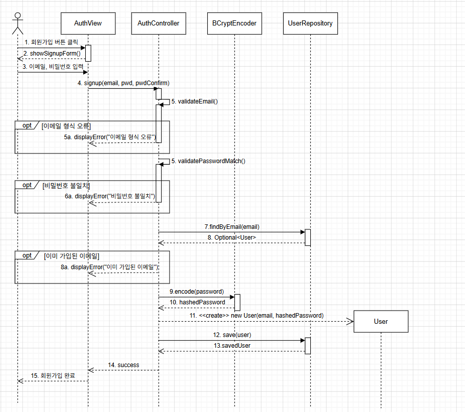

사용자가 이메일, 비밀번호, 비밀번호 확인을 입력하고 회원가입 버튼을 클릭하면 AuthController가 이메일 형식과 비밀번호 일치 여부를 순서대로 검사한다. 두 검증을 통과하면 UserRepository로 중복 이메일 여부를 확인하고, 중복이 없으면 BCryptPasswordEncoder로 비밀번호를 암호화한 뒤 새로운 User 객체를 생성하여 데이터베이스에 저장한다. 각 검증 실패 시에는 AuthView에 해당 오류 메시지를 표시한다.

### 3.2. 로그인

아래의 다이어그램은 로그인 기능에 대한 Sequence diagram이다.

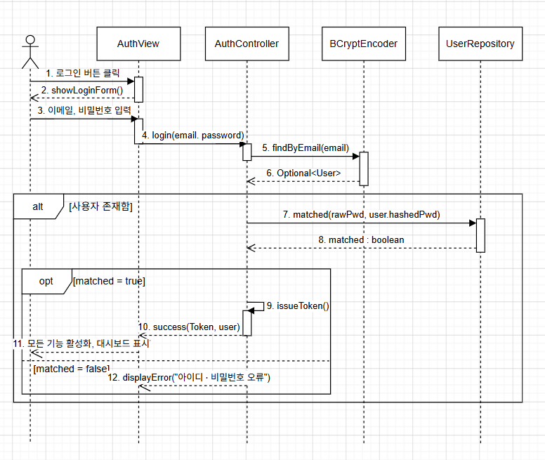

사용자가 이메일과 비밀번호를 입력하고 로그인 버튼을 클릭하면 AuthController가 UserRepository로 해당 이메일의 사용자를 조회한다. 사용자가 존재하면 BCryptPasswordEncoder로 비밀번호 일치 여부를 검증하고, 일치하면 issueToken()으로 세션 토큰을 발급하여 모든 기능을 활성화한다. 비밀번호가 일치하지 않으면 AuthView에 오류 메시지를 표시한다.

### 3.3. 메인 대시보드

#### 3.3.1. 메인 대시보드 조회

아래의 다이어그램은 메인 대시보드 조회에 대한 Sequence diagram이다.

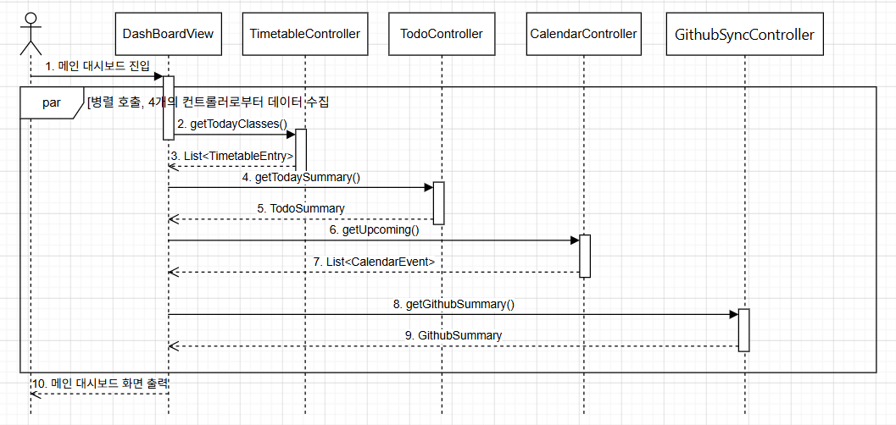

로그인 성공 후 대시보드 화면이 로드되면 DashboardView가 TimetableController, TodoController, CalendarController, GithubSyncController 네 개의 컨트롤러를 병렬로 호출하여 오늘의 시간표, 할 일 요약, 다가오는 일정, GitHub 활동 요약 데이터를 동시에 가져온다. 수집된 데이터를 화면에 통합하여 대시보드를 렌더링한다.

#### 3.3.2. 프로필 수정

아래의 다이어그램은 프로필 수정에 대한 Sequence diagram이다.

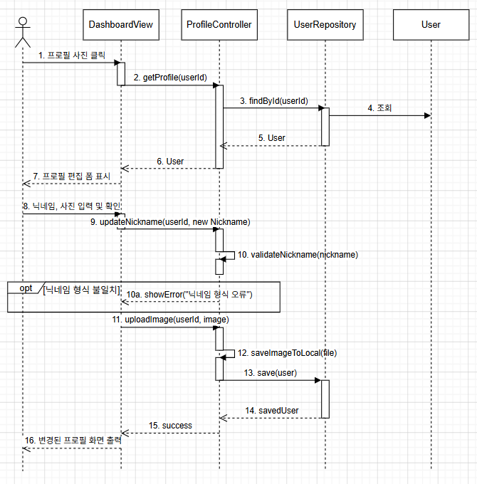

사용자가 프로필 사진을 클릭하면 DashboardView가 ProfileController를 통해 현재 프로필 정보를 조회하여 편집 폼을 표시한다. 사용자가 새 닉네임과 사진을 입력하고 확인을 클릭하면 validateNickname()으로 닉네임 형식을 검사하고, 형식에 맞지 않으면 showError()로 오류를 표시한다. 검증을 통과하면 saveImageToLocal()로 이미지를 로컬에 저장하고 변경된 프로필을 데이터베이스에 반영한다.

### 3.4. To-do list

#### 3.4.1. To-do list 조회

아래의 다이어그램은 To-do list 조회에 대한 Sequence diagram이다.

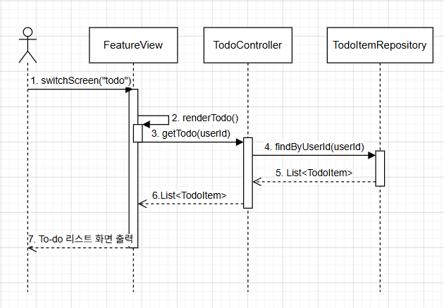

사용자가 사이드바에서 To-do 메뉴를 클릭하면 FeatureView가 switchScreen("todo")를 호출하여 화면을 전환하고 renderTodo()를 실행한다. TodoController가 TodoItemRepository에서 해당 사용자의 전체 할 일 목록을 조회하여 화면에 표시한다.

#### 3.4.2. To-do list 추가

아래의 다이어그램은 To-do list 추가에 대한 Sequence diagram이다.

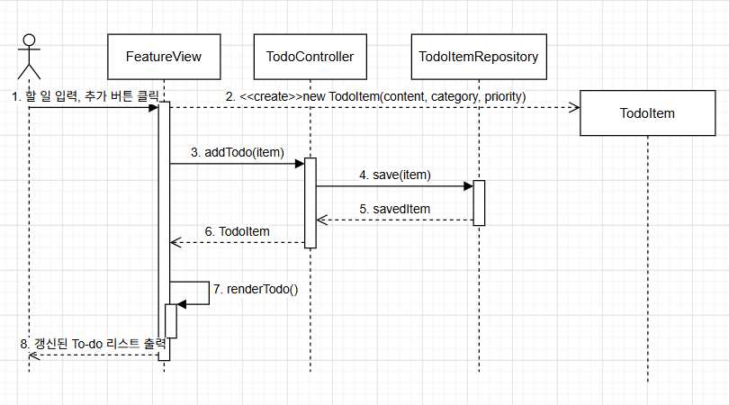

사용자가 새 할 일을 입력하고 추가 버튼을 클릭하면 FeatureView가 새 TodoItem 객체를 생성하여 TodoController.addTodo()를 호출한다. TodoController가 해당 항목을 데이터베이스에 저장하고 나면 renderTodo()를 다시 호출하여 목록을 갱신하여 화면에 표시한다.

#### 3.4.3. To-do list 삭제

아래의 다이어그램은 To-do list 삭제에 대한 Sequence diagram이다.

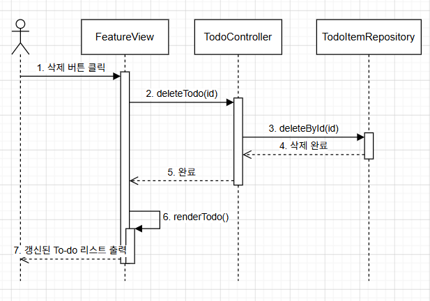

사용자가 삭제 버튼을 클릭하면 FeatureView가 TodoController.deleteTodo(id)를 호출하여 해당 항목을 데이터베이스에서 삭제한다. 삭제 완료 후 renderTodo()를 다시 호출하여 갱신된 목록을 화면에 표시한다.

### 3.5. Calendar

#### 3.5.1. Calendar 조회

아래의 다이어그램은 Calendar 조회에 대한 Sequence diagram이다.

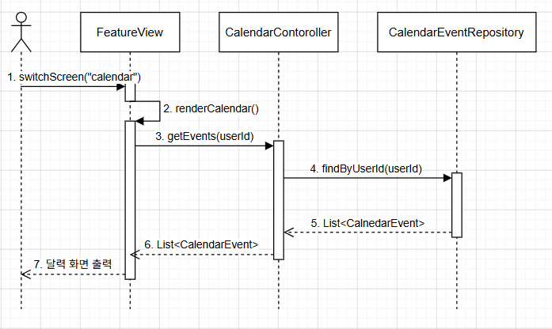

사용자가 사이드바에서 달력 메뉴를 클릭하면 FeatureView가 switchScreen("calendar")를 호출하여 화면을 전환하고 renderCalendar()를 실행한다. CalendarController가 CalendarEventRepository에서 해당 사용자의 전체 일정을 조회하여 달력 화면에 표시한다.

#### 3.5.2. Calendar 추가

아래의 다이어그램은 Calendar 추가에 대한 Sequence diagram이다.

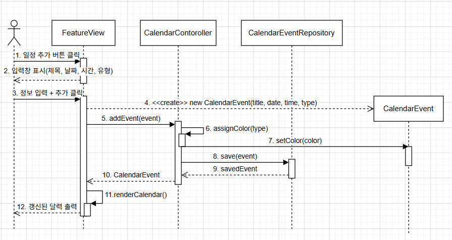

사용자가 날짜, 제목, 시각, 유형을 입력하고 추가 버튼을 클릭하면 FeatureView가 새 CalendarEvent 객체를 생성하여 CalendarController.addEvent()를 호출한다. CalendarController는 assignColor()로 일정 유형에 맞는 색상을 배정한 뒤 데이터베이스에 저장하고, 완료 후 renderCalendar()로 화면을 갱신한다.

#### 3.5.3. Calendar 삭제

아래의 다이어그램은 Calendar 삭제에 대한 Sequence diagram이다.

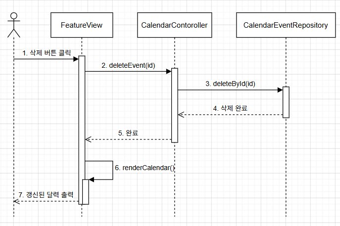

사용자가 삭제 버튼을 클릭하면 FeatureView가 CalendarController.deleteEvent(id)를 호출하여 해당 일정을 데이터베이스에서 삭제한다. 삭제 완료 후 renderCalendar()로 갱신된 달력을 화면에 표시한다.

### 3.6. 시간표

#### 3.6.1. 시간표 조회

아래의 다이어그램은 시간표 조회에 대한 Sequence diagram이다.

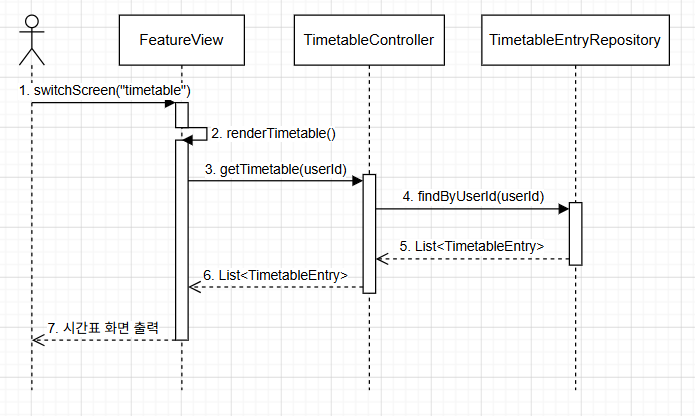

사용자가 사이드바에서 시간표 메뉴를 클릭하면 FeatureView가 switchScreen("timetable")를 호출하고 renderTimetable()을 실행한다. TimetableController가 TimetableEntryRepository에서 해당 사용자의 전체 시간표를 조회하여 화면에 표시한다.

#### 3.6.2. 시간표 추가

아래의 다이어그램은 시간표 추가에 대한 Sequence diagram이다.

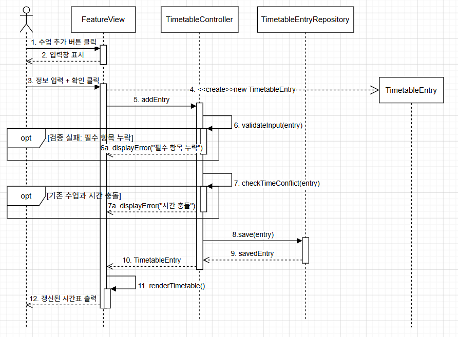

사용자가 과목명, 강의실, 요일, 시간, 색상을 입력하고 추가 버튼을 클릭하면 새 TimetableEntry 객체가 생성되어 TimetableController.addEntry()가 호출된다. validateInput()으로 필수 입력값 누락 여부를 검사하고, checkTimeConflict()로 기존 수업과의 시간 충돌을 확인한다. 두 검증을 모두 통과하면 데이터베이스에 저장하고 renderTimetable()로 화면을 갱신한다. 각 검증 실패 시에는 displayError()로 오류를 표시한다.

#### 3.6.3. 시간표 삭제

아래의 다이어그램은 시간표 삭제에 대한 Sequence diagram이다.

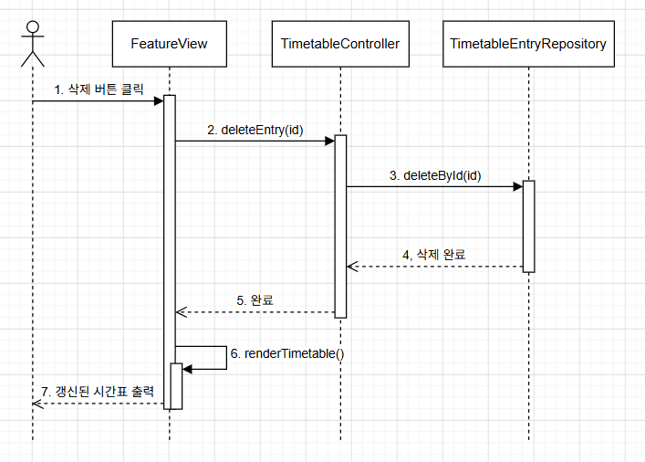

사용자가 삭제 버튼을 클릭하면 FeatureView가 TimetableController.deleteEntry(id)를 호출하여 해당 수업 항목을 데이터베이스에서 삭제한다. 삭제 완료 후 renderTimetable()로 갱신된 시간표를 화면에 표시한다.

### 3.7. 깃허브 연동

#### 3.7.1. 깃허브 설정

아래의 다이어그램은 깃허브 설정 기능에 대한 Sequence diagram이다.

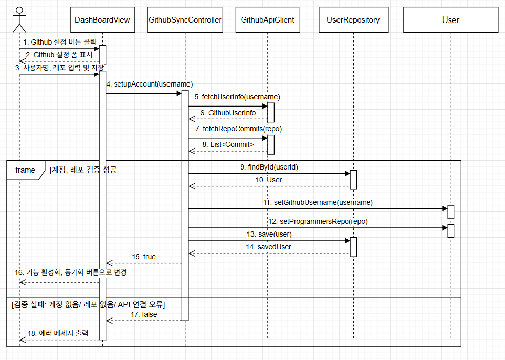

사용자가 GitHub 사용자명과 백준허브 레포지토리명을 입력하고 확인을 클릭하면 GithubSyncController가 setupAccount()를 호출한다. 내부적으로 GithubApiClient를 통해 GitHub 계정 유효성과 레포지토리 존재 여부를 순서대로 검증하고, 검증에 성공하면 해당 정보를 사용자 데이터에 저장하고 기능을 활성화한다. 검증 실패 시에는 통합 오류 메시지를 표시한다.

#### 3.7.2. 깃허브 동기화

아래의 다이어그램은 깃허브 동기화 기능에 대한 Sequence diagram이다.

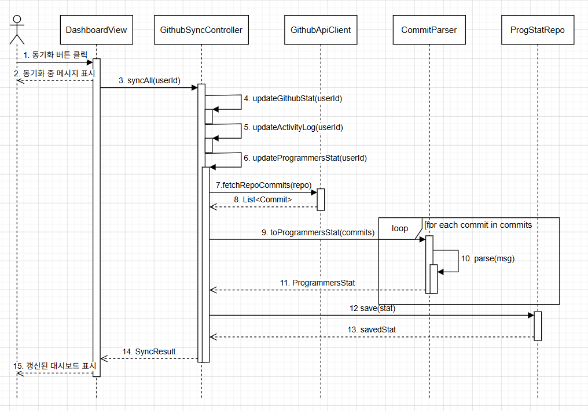

사용자가 대시보드의 동기화 버튼을 클릭하면 DashboardView가 "동기화 중" 메시지를 표시하고 GithubSyncController.syncAll()을 호출한다. syncAll() 내부에서 updateGithubStat(), updateActivityLog(), updateProgrammersStat()을 순차적으로 실행한다. 그 중 updateProgrammersStat()은 GithubApiClient로 백준허브 레포지토리의 커밋 목록을 가져와 CommitMessageParser가 각 커밋 메시지를 반복 파싱하고, 생성된 ProgrammersStat을 ProgrammersStatRepository에 저장한다. 모든 동기화가 완료되면 SyncResult를 반환하고 대시보드를 갱신한다.

### 3.8. 깃허브 활동 내역 조회

아래의 다이어그램은 깃허브 활동 내역 조회에 대한 Sequence diagram이다.

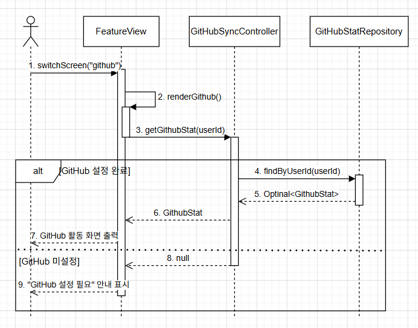

사용자가 사이드바에서 GitHub 메뉴를 클릭하면 FeatureView가 switchScreen("github")를 호출하고 renderGithub()를 실행한다. GithubSyncController.getGithubStat()이 GithubStatRepository에서 통계 데이터를 조회하여 반환하고, 설정이 완료된 경우 주간 커밋, streak, 잔디 등을 화면에 표시한다. GitHub 계정이 미설정 상태이면 설정 필요 안내를 표시한다.

### 3.9. 프로그래머스 활동 내역 조회

아래의 다이어그램은 프로그래머스 문제 풀이 내역에 대한 Sequence diagram이다.

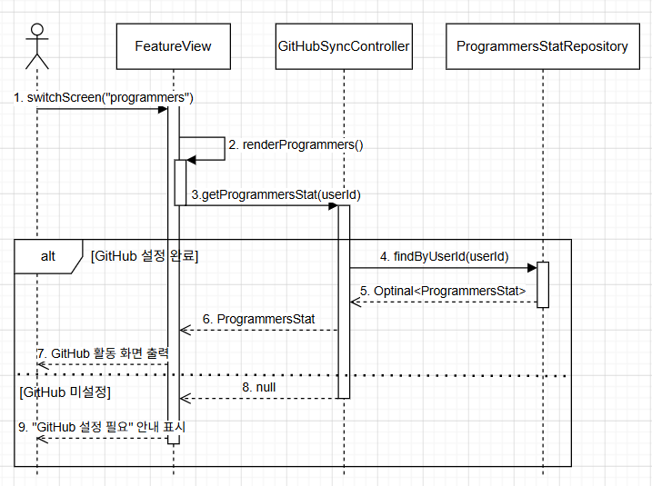

사용자가 사이드바에서 프로그래머스 메뉴를 클릭하면 FeatureView가 switchScreen("programmers")를 호출하고 renderProgrammers()를 실행한다. GithubSyncController.getProgrammersStat()이 ProgrammersStatRepository에서 통계 데이터를 조회하여 반환하고, 설정이 완료된 경우 총 풀이 수, 레벨 분포, 월별 통계 등을 화면에 표시한다. 미설정 상태이면 설정 필요 안내를 표시한다.

---

## 4. State machine diagram

아래의 다이어그램은 Dev Learning Hub에 대한 State machine diagram이다.

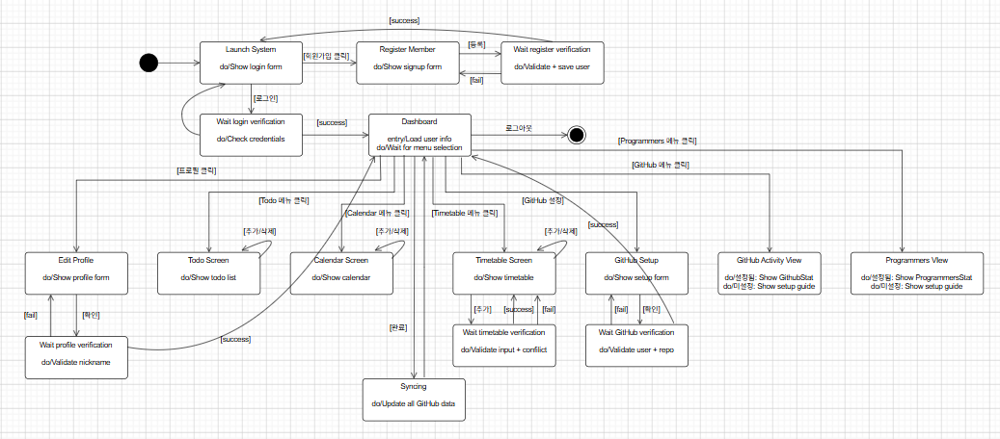

| State | Description |
|:---:|---|
| Launch System | 시스템이 실행된 상태다. 로그인 폼이 화면에 표시되며 사용자는 이메일과 비밀번호를 입력하거나 회원가입 버튼을 클릭할 수 있다. |
| Register Member | 사용자가 회원가입 버튼을 클릭하여 회원가입 폼이 표시된 상태다. 이메일, 비밀번호, 비밀번호 확인을 입력하고 등록 버튼을 클릭하면 다음 상태로 전이된다. |
| Wait register verification | 입력된 회원가입 정보의 유효성을 검사하고 데이터베이스에 저장하는 상태다. 이메일 형식, 비밀번호 일치 여부, 중복 이메일 여부를 순서대로 검사하며, 검증에 성공하면 Launch System으로 돌아가고 실패하면 Register Member로 복귀한다. |
| Wait login verification | 입력된 이메일과 비밀번호의 자격 증명을 검사하는 상태다. 이메일로 사용자를 조회하고 비밀번호 일치 여부를 확인하며, 검증에 성공하면 Dashboard로 전이하고 실패하면 Launch System으로 복귀한다. |
| Dashboard | 로그인에 성공한 사용자가 진입하는 메인 화면 상태다. 오늘의 시간표, 할 일 요약, 다가오는 일정, GitHub 활동 요약이 한 화면에 표시된다. 사이드바 메뉴를 통해 모든 기능 화면으로 진입할 수 있으며 동기화 버튼과 로그아웃 버튼도 이 상태에서 사용할 수 있다. |
| Edit Profile | 사용자가 프로필 사진을 클릭하여 프로필 편집 폼이 표시된 상태다. 닉네임과 프로필 이미지를 수정할 수 있으며 확인 버튼을 클릭하면 Wait profile verification 상태로 전이된다. |
| Wait profile verification | 입력된 닉네임의 형식을 검사하는 상태다. 검증에 성공하면 변경 사항을 데이터베이스에 저장하고 Dashboard로 복귀하며, 실패하면 오류 메시지를 표시하고 Edit Profile 상태로 돌아간다. |
| Todo Screen | To-do 기능 화면이 활성화된 상태다. 사용자의 전체 할 일 목록이 표시되며 할 일 추가, 삭제, 완료 상태 변경 등의 동작이 모두 이 상태 내에서 반복적으로 수행된다. |
| Calendar Screen | 달력 기능 화면이 활성화된 상태다. 사용자의 전체 일정이 달력 형태로 표시되며 일정 추가와 삭제 동작이 이 상태 내에서 반복적으로 수행된다. |
| Timetable Screen | 시간표 기능 화면이 활성화된 상태다. 사용자의 주간 시간표가 표시되며 수업 삭제는 이 상태 내에서 바로 처리된다. 수업 추가 시에는 Wait timetable verification 상태로 전이된다. |
| Wait timetable verification | 추가하려는 수업 항목의 유효성을 검사하는 상태다. 필수 입력값 누락 여부와 기존 수업과의 시간 충돌 여부를 순서대로 확인하며, 검증 성공 또는 실패 모두 Timetable Screen으로 복귀한다. 실패 시에는 오류 메시지가 함께 표시된다. |
| GitHub Setup | 사용자가 사이드바의 GitHub 설정 메뉴를 클릭하면 진입하는 상태다. 설정 여부와 관계없이 언제든 접근할 수 있으며, GitHub 사용자명과 백준허브 레포지토리명을 입력하고 확인 버튼을 클릭하면 Wait GitHub verification 상태로 전이된다. |
| Wait GitHub verification | 입력된 GitHub 계정과 레포지토리의 유효성을 GitHub API를 통해 검증하는 상태다. 검증에 성공하면 해당 정보를 사용자 데이터에 저장하고 Dashboard로 복귀하며, 실패하면 GitHub Setup으로 돌아간다. |
| GitHub Activity View | 사용자가 사이드바의 GitHub 메뉴를 클릭하면 진입하는 상태다. 설정 여부와 관계없이 항상 진입할 수 있으며, 계정이 설정된 경우 주간 커밋 수, 연속 커밋 일수, 연간 기여도 잔디 등의 통계를 표시하고, 미설정 상태인 경우 기능이 비활성화된 안내 화면을 표시한다. |
| Programmers View | 사용자가 사이드바의 Programmers 메뉴를 클릭하면 진입하는 상태다. GitHub Activity View와 동일하게 설정 여부와 관계없이 항상 진입할 수 있으며, 계정이 설정된 경우 총 풀이 수, 레벨 분포, 월별 통계 등을 표시하고, 미설정 상태인 경우 기능이 비활성화된 안내 화면을 표시한다. |
| Syncing | 동기화 버튼 클릭으로 GitHub 데이터 동기화가 진행 중인 상태다. GitHub 활동 통계, 활동 로그, 프로그래머스 통계를 순차적으로 갱신하며 동기화가 완료되면 Dashboard로 복귀한다. |

---

## 5. Implementation requirements

### 5.1. Hardware Requirements

| 항목 | 요구 사항 |
|:---:|---|
| CPU | Intel Core i5 이상 |
| RAM | 8GB |
| Storage | 10GB 이상의 여유 공간 |
| Network | 인터넷 연결 필수 (GitHub API 연동) |

### 5.2. Software Requirements

| 항목 | 요구 사항 |
|:---:|---|
| OS | Windows 10 / macOS 12 이상 / Ubuntu 20.04 이상 |
| Language | Java 17 이상 |
| Framework | Spring Boot 3.x |
| Frontend | React 18.x |
| Database | MySQL 8.x |
| Build Tool | Gradle 8.x |
| Runtime | Node.js 18.x 이상 |

### 5.3. Nonfunctional Requirements

| 항목 | 요구 사항 |
|:---:|---|
| 서버 실행 | 시스템 이용 전 사용자가 직접 로컬 환경에서 MySQL 서버, Spring Boot 백엔드 서버, React 프론트엔드를 순서대로 실행해야 한다. |
| 외부 API | GitHub REST API를 사용하며 데이터 동기화 기능 이용 시 GitHub Personal Access Token이 필요하다. |
| 보안 | 사용자 비밀번호는 BCrypt 알고리즘으로 단방향 암호화하여 데이터베이스에 저장된다. |
| 데이터 저장 | 모든 사용자 데이터는 로컬 MySQL 데이터베이스에 저장된다. |
| 동기화 | 데이터 동기화는 사용자가 대시보드에서 직접 동기화 버튼을 클릭할 때만 수행된다. |

---

## 6. Glossary

| Terms | Description |
|:---:|---|
| 4차 산업혁명 | 인공지능(AI), 빅데이터, 사물인터넷(IoT) 등 첨단 정보통신기술이 경제와 사회 전반에 융합되어 나타나는 혁신적인 변화 |
| 알고리즘 | 어떤 문제를 해결하기 위해 정해진 일련의 절차나 규칙 |
| 코딩테스트 | 개발자의 논리적 사고와 프로그래밍 능력을 검증하기 위해 알고리즘 문제를 풀게 하는 시험 |
| GitHub API | 개발자용 플랫폼인 GitHub의 기능을 외부 프로그램에서도 사용할 수 있도록 제공하는 인터페이스 |
| Dom | 웹 페이지의 콘텐츠(HTML)를 프로그래밍 언어가 이해할 수 있는 트리 형태의 구조로 만든 모델 |
| DB | 데이터를 효율적으로 저장, 관리, 조회하기 위해 체계적으로 모아놓은 데이터의 집합소 |
| 백준 | 국내에서 가장 유명한 알고리즘 문제 풀이 사이트 중 하나로, 다양한 난이도의 문제를 제공한다. 하지만 현재는 서비스가 종료되었다. |
| 프로그래머스 | 실무 중심의 코딩 테스트 문제와 교육 과정을 제공하는 플랫폼으로, 많은 기업의 채용 시험에 활용된다. |
| 동기화 | 여러 기기나 시스템 간의 데이터가 동일하게 유지되도록 일치시키는 과정 |
| 레코드 | 데이터베이스에서 한 개체에 대한 모든 관련 데이터를 묶어 놓은 한 행 |
| 필터링 | 데이터 집합에서 특정 조건에 맞는 데이터만 골라내는 작업 |
| 메서드 | 클래스 안에 정의된 특정 기능을 수행하는 코드 묶음 |
| 정규식 | 문자열이 특정한 패턴을 만족하는지 검사하거나, 원하는 부분을 찾기 위한 규칙 |
| 세션 토큰 | 사용자가 로그인했다는 사실을 서버가 기억하기 위해 사용하는 식별자 |
| 프레임워크 | 프로그램을 만들 때 자주 필요한 기능들을 미리 만들어 놓은 뼈대 |

---

## 7. References

- draw.io 공식 문서  
  - https://www.drawio.com/docs/diagram-types/uml/class-diagrams/  
  - https://www.drawio.com/docs/diagram-types/uml/sequence-diagrams/  
  - https://www.drawio.com/docs/diagram-types/uml/state-diagrams/
